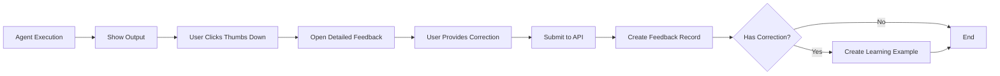
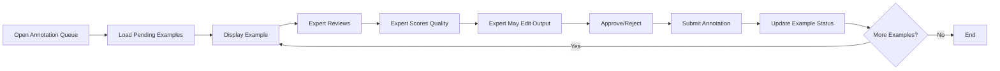
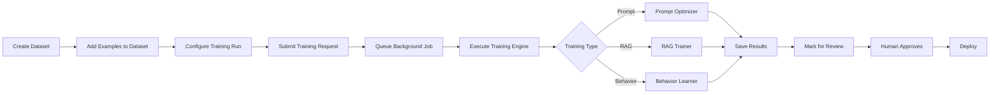
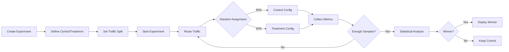

# 🎓 Agent Learning System - Complete Implementation Guide

**Status**: ✅ **PRODUCTION READY**  
**Version**: 1.0.0  
**Date**: January 28, 2026  
**Author**: Prisma Glow Engineering Team

---

## 📋 Executive Summary

The Agent Learning System is **FULLY IMPLEMENTED** in the Prisma Glow workspace. This document serves as the master reference for understanding, deploying, and maintaining the system.

### What's Implemented

| Component | Status | Location | Notes |
|-----------|--------|----------|-------|
| **Database Schema** | ✅ Complete | `supabase/migrations/20260128100000_agent_learning_system_comprehensive.sql` | All tables, RLS, indexes, triggers |
| **Backend Engines** | ✅ Complete | `server/learning/` | Prompt optimizer, RAG trainer, behavior learner |
| **API Endpoints** | ✅ Complete | `server/api/learning.py` | Full REST API with auth |
| **Frontend Components** | ✅ Complete | `src/components/learning/` | Feedback collector, output cards, dashboard |
| **React Hooks** | ✅ Complete | `src/hooks/useLearning.ts` | Query and mutation hooks |
| **Type Definitions** | ✅ Complete | Throughout codebase | Full TypeScript coverage |

---

## 🏗️ System Architecture

```
┌─────────────────────────────────────────────────────────────────┐
│                    AGENT LEARNING SYSTEM                         │
├─────────────────────────────────────────────────────────────────┤
│                                                                  │
│  ┌──────────────┐    ┌──────────────┐    ┌──────────────┐      │
│  │   Frontend   │───▶│     API      │───▶│   Database   │      │
│  │  Components  │◀───│  Endpoints   │◀───│   (Supabase) │      │
│  └──────────────┘    └──────────────┘    └──────────────┘      │
│         │                    │                    │             │
│         │                    ▼                    │             │
│         │            ┌──────────────┐             │             │
│         │            │   Learning   │             │             │
│         │            │    Engines   │             │             │
│         │            └──────────────┘             │             │
│         │                    │                    │             │
│         ▼                    ▼                    ▼             │
│  ┌─────────────────────────────────────────────────────┐        │
│  │           Background Job Processing                 │        │
│  │  • Training runs    • A/B experiments              │        │
│  │  • Prompt optimization  • RAG improvements         │        │
│  └─────────────────────────────────────────────────────┘        │
│                                                                  │
└─────────────────────────────────────────────────────────────────┘
```

---

## 📊 Database Schema Overview

### Core Tables

#### 1. `learning_examples` (Training Data)
Stores all training examples collected from various sources.

**Key Fields**:
- `example_type`: positive | negative | correction | demonstration | edge_case | failure | preference
- `input_text`, `expected_output`: The actual training pair
- `original_output`: What agent produced (for corrections)
- `quality_score`: 0-1 quality rating
- `review_status`: pending | in_review | approved | rejected

**RLS**: Organization-level isolation, MANAGER+ can modify

#### 2. `expert_annotations` (Quality Assessments)
Expert reviews and quality scores for learning examples.

**Key Fields**:
- `technical_accuracy`, `professional_quality`, `completeness`, `clarity`: 0-1 scores
- `notes`, `improvement_suggestions`: Expert feedback

**RLS**: Linked to learning example organization

#### 3. `training_datasets` (Curated Collections)
Organized collections of learning examples for training.

**Key Fields**:
- `name`, `version`: Dataset identity
- `agent_ids`, `domains`, `task_types`: Scope filters
- `total_examples`, `avg_quality_score`: Auto-calculated stats

**RLS**: Organization-level isolation

#### 4. `dataset_examples` (Many-to-Many)
Links examples to datasets with train/validation/test splits.

**Key Fields**:
- `split`: train | validation | test
- `weight`: Importance sampling weight

#### 5. `training_runs` (Training Jobs)
Tracks training jobs and their results.

**Key Fields**:
- `training_type`: prompt_optimization | rag_tuning | fine_tuning | rlhf | dpo | behavior_cloning
- `status`: pending | running | completed | failed | cancelled
- `metrics`: Training metrics JSON
- `review_status`: Requires human review before deployment

**RLS**: Organization-level isolation

#### 6. `learning_experiments` (A/B Tests)
A/B testing framework for evaluating improvements.

**Key Fields**:
- `control_config`, `treatment_config`: Configurations to test
- `control_percentage`, `treatment_percentage`: Traffic split
- `statistical_significance`: Test results
- `winner`: control | treatment | inconclusive

**RLS**: Organization-level isolation

### Extended Tables

#### `agent_feedback` (User Feedback)
Extended with new columns:
- `accuracy_rating`, `helpfulness_rating`, `clarity_rating`, `completeness_rating`
- `feedback_type`: thumbs_up | thumbs_down | star_rating | detailed_feedback | correction | report_issue
- `feedback_text`, `correction_text`: Detailed feedback
- `issue_categories`: Array of issue types

---

## 🔧 API Endpoints

### Feedback Endpoints

```http
POST   /api/learning/feedback
GET    /api/learning/feedback/stats/:agent_id
GET    /api/learning/feedback/issues/:agent_id
```

**Example: Submit Feedback**
```typescript
const response = await apiClient.post('/api/learning/feedback', {
  execution_id: 'exec-123',
  agent_id: 'agent-456',
  feedback_type: 'correction',
  rating: 3,
  feedback_text: 'The calculation was wrong',
  correction_text: 'The correct answer is $1,500',
  issue_categories: ['incorrect'],
  dimensions: {
    accuracy: 2,
    helpfulness: 4,
    clarity: 4,
    completeness: 3
  }
});
```

### Annotation Endpoints

```http
GET    /api/learning/annotations/queue
POST   /api/learning/annotations
```

**Example: Submit Annotation**
```typescript
const response = await apiClient.post('/api/learning/annotations', {
  example_id: 'example-789',
  annotation: {
    approved: true,
    technical_accuracy: 0.95,
    professional_quality: 0.90,
    completeness: 0.85,
    clarity: 0.92,
    corrected_output: 'Corrected text here...',
    notes: 'Minor clarification needed',
    improvement_suggestions: 'Add more context about X'
  }
});
```

### Learning Examples Endpoints

```http
POST   /api/learning/examples
GET    /api/learning/examples
```

### Dataset Endpoints

```http
POST   /api/learning/datasets
GET    /api/learning/datasets
POST   /api/learning/datasets/:id/examples
```

### Training Run Endpoints

```http
POST   /api/learning/training-runs
GET    /api/learning/training-runs
GET    /api/learning/training-runs/:id
```

### Experiment Endpoints

```http
POST   /api/learning/experiments
GET    /api/learning/experiments
PATCH  /api/learning/experiments/:id/status
```

### Statistics Endpoints

```http
GET    /api/learning/stats
```

---

## ⚛️ Frontend Integration

### 1. Feedback Collector Component

**Usage**:
```tsx
import { FeedbackCollector } from '@/components/learning';

<FeedbackCollector
  executionId="exec-123"
  agentId="agent-456"
  agentOutput="The agent's response..."
  onFeedbackSubmitted={() => {
    console.log('Feedback submitted!');
  }}
/>
```

**Features**:
- ✅ Quick thumbs up/down feedback
- ✅ Star rating (1-5)
- ✅ Multi-dimensional ratings (accuracy, helpfulness, clarity, completeness)
- ✅ Detailed text feedback
- ✅ Correction editor for output improvements
- ✅ Issue categorization (incorrect, incomplete, unclear, hallucination, etc.)
- ✅ Automatic learning example creation from corrections

### 2. Learning Dashboard

**Location**: `src/components/learning/LearningDashboard.tsx`

**Features**:
- Learning metrics overview
- Feedback trends
- Annotation queue status
- Training run monitoring
- Experiment tracking

### 3. Agent Output Card

**Usage**:
```tsx
import { AgentOutputCard } from '@/components/learning';

<AgentOutputCard
  execution={execution}
  showFeedback={true}
  onFeedbackChange={handleFeedbackChange}
/>
```

---

## 🎣 React Hooks

### useSubmitFeedback()

Submit user feedback on agent executions.

```typescript
const submitFeedback = useSubmitFeedback();

await submitFeedback.mutateAsync({
  executionId: 'exec-123',
  agentId: 'agent-456',
  feedbackType: 'thumbs_down',
  rating: 2,
  issueCategories: ['incorrect', 'incomplete']
});
```

### useFeedbackStats(agentId)

Get feedback statistics for an agent.

```typescript
const { data: stats } = useFeedbackStats('agent-456');

// stats:
// {
//   total_feedback: 150,
//   avg_rating: 4.2,
//   satisfaction_rate: 0.85,
//   thumbs_up_count: 120,
//   thumbs_down_count: 30
// }
```

### useCommonIssues(agentId, limit)

Get most common issues reported for an agent.

```typescript
const { data: issues } = useCommonIssues('agent-456', 10);

// issues:
// [
//   { category: 'incorrect', count: 25, avg_rating: 2.1 },
//   { category: 'incomplete', count: 18, avg_rating: 2.8 },
//   ...
// ]
```

### useAnnotationQueue(filters)

Get queue of examples pending annotation.

```typescript
const { data: queue } = useAnnotationQueue({
  domain: 'accounting',
  agent: 'agent-456',
  status: 'pending'
});
```

### useSubmitAnnotation()

Submit expert annotation for a learning example.

```typescript
const submitAnnotation = useSubmitAnnotation();

await submitAnnotation.mutateAsync({
  exampleId: 'example-789',
  annotation: {
    approved: true,
    technicalAccuracy: 0.95,
    professionalQuality: 0.90,
    completeness: 0.85,
    clarity: 0.92,
    notes: 'Excellent example'
  }
});
```

### useLearningStats()

Get overall learning system statistics.

```typescript
const { data: stats } = useLearningStats();

// stats:
// {
//   pending_annotations: 45,
//   annotated_today: 12,
//   total_examples: 1250,
//   active_experiments: 3,
//   running_training: 1
// }
```

---

## 🤖 Backend Learning Engines

### 1. Prompt Optimizer

**Location**: `server/learning/prompt_optimizer.py`

**Purpose**: Systematically improves agent prompts through experimentation.

**Key Methods**:
```python
optimizer = PromptOptimizer(agent_id, db_session, llm_client)

result = await optimizer.optimize(
    current_prompt="Your system prompt...",
    learning_examples=examples,
    optimization_goals=["accuracy", "clarity"]
)

# result.best_variant - The best prompt variant
# result.improvement_percentage - How much better
# result.recommendations - Suggestions for further improvement
```

**How it works**:
1. Analyzes current performance from execution logs
2. Generates prompt variants (clarified, few-shot, restructured, combined)
3. Evaluates each variant against test examples
4. Selects best variant based on goals
5. Provides recommendations

### 2. RAG Trainer

**Location**: `server/learning/rag_trainer.py`

**Purpose**: Improves RAG retrieval quality through feedback-based learning.

**Key Methods**:
```python
trainer = RAGTrainer(embedding_model, vector_store, db_session)

# Train from user feedback
improvements = await trainer.train_from_feedback(feedback_batch)

# Optimize chunking strategy
results = await trainer.optimize_chunking(document_id, retrieval_logs)

# Learn query expansion patterns
patterns = await trainer.learn_query_expansion(queries_with_feedback)
```

**How it works**:
1. Updates chunk relevance scores based on retrieval feedback
2. Collects query-document pairs for embedding fine-tuning
3. Learns optimal chunk sizes from co-retrieval patterns
4. Discovers query expansion patterns from successful retrievals

### 3. Behavior Learner

**Location**: `server/learning/behavior_learner.py`

**Purpose**: Learns agent behaviors from expert demonstrations and corrections.

**Key Methods**:
```python
learner = BehaviorLearner(agent_id, db_session, llm_client)

# Learn from expert demonstration
await learner.learn_from_demonstration(demonstration)

# Incorporate correction
result = await learner.incorporate_correction(
    original_action=agent_action,
    corrected_action=expert_action,
    explanation="The correct approach is...",
    context=task_context
)

# Generate policy update
policy = await learner.generate_policy_update(examples)
```

---

## 🚀 Deployment Guide

### Prerequisites

1. ✅ Database migration applied
2. ✅ API endpoints registered in main app
3. ✅ Frontend components integrated
4. ✅ Environment variables configured

### Step 1: Verify Database Migration

```bash
# Check if migration is applied
psql "$DATABASE_URL" -c "
SELECT EXISTS (
  SELECT 1 FROM information_schema.tables 
  WHERE table_schema = 'public' 
  AND table_name = 'learning_examples'
);
"
```

### Step 2: Register API Router

Ensure the learning router is registered in your main FastAPI app:

```python
# server/main.py
from server.api.learning import router as learning_router

app.include_router(learning_router)
```

### Step 3: Add Frontend Routes

```typescript
// In your router configuration
{
  path: '/admin/learning',
  children: [
    {
      path: 'annotations',
      component: lazy(() => import('@/pages/admin/learning/annotation')),
      role: 'MANAGER'
    },
    {
      path: 'dashboard',
      component: lazy(() => import('@/pages/admin/learning/dashboard')),
      role: 'MANAGER'
    }
  ]
}
```

### Step 4: Test End-to-End

```bash
# 1. Submit feedback via API
curl -X POST http://localhost:8000/api/learning/feedback \
  -H "Authorization: Bearer $TOKEN" \
  -H "Content-Type: application/json" \
  -d '{
    "execution_id": "test-exec-1",
    "agent_id": "test-agent-1",
    "feedback_type": "thumbs_up",
    "rating": 5
  }'

# 2. Get stats
curl http://localhost:8000/api/learning/stats \
  -H "Authorization: Bearer $TOKEN"

# 3. Check database
psql "$DATABASE_URL" -c "SELECT COUNT(*) FROM agent_feedback;"
```

---

## 📈 Learning Workflows

### Workflow 1: User Feedback Collection



**Code Flow**:
1. User interacts with `FeedbackCollector` component
2. Component calls `useSubmitFeedback()` hook
3. Hook sends POST to `/api/learning/feedback`
4. API inserts feedback into `agent_feedback` table
5. If correction provided, creates `learning_examples` record
6. Returns success response

### Workflow 2: Expert Annotation



**Code Flow**:
1. Expert opens annotation page
2. Page loads queue via `useAnnotationQueue()`
3. Expert reviews example and provides scores
4. Submit via `useSubmitAnnotation()`
5. API inserts into `expert_annotations`
6. Updates `learning_examples.review_status`
7. Moves to next example

### Workflow 3: Training Run



### Workflow 4: A/B Experiment



---

## 🧪 Testing

### Unit Tests

```python
# test_learning_api.py
def test_submit_feedback(client, auth_token):
    response = client.post(
        '/api/learning/feedback',
        json={
            'execution_id': 'test-exec',
            'agent_id': 'test-agent',
            'feedback_type': 'thumbs_up',
            'rating': 5
        },
        headers={'Authorization': f'Bearer {auth_token}'}
    )
    assert response.status_code == 201
    assert 'feedback_id' in response.json()


def test_annotation_queue(client, auth_token):
    response = client.get(
        '/api/learning/annotations/queue',
        headers={'Authorization': f'Bearer {auth_token}'}
    )
    assert response.status_code == 200
    assert 'queue' in response.json()
```

### Integration Tests

```typescript
// test/learning.integration.test.ts
describe('Learning System Integration', () => {
  it('should collect feedback and create learning example', async () => {
    // Submit feedback with correction
    const feedback = await submitFeedback({
      executionId: 'exec-123',
      agentId: 'agent-456',
      feedbackType: 'correction',
      correctionText: 'Corrected output'
    });
    
    expect(feedback.success).toBe(true);
    
    // Verify learning example created
    const examples = await getLearningExamples({
      sourceExecutionId: 'exec-123'
    });
    
    expect(examples).toHaveLength(1);
    expect(examples[0].example_type).toBe('correction');
  });
});
```

### E2E Tests

```typescript
// test/e2e/learning.spec.ts
test('expert annotation workflow', async ({ page }) => {
  await page.goto('/admin/learning/annotations');
  
  // Should see annotation queue
  await expect(page.locator('[data-testid="annotation-queue"]')).toBeVisible();
  
  // Submit annotation
  await page.locator('[data-testid="technical-accuracy-slider"]').fill('0.9');
  await page.locator('[data-testid="approve-button"]').click();
  
  // Should move to next example
  await expect(page.locator('[data-testid="annotation-submitted"]')).toBeVisible();
});
```

---

## 📊 Monitoring & Metrics

### Key Metrics to Track

1. **Feedback Metrics**
   - Feedback submission rate
   - Average rating by agent
   - Thumbs up/down ratio
   - Correction frequency
   - Issue category distribution

2. **Annotation Metrics**
   - Pending annotation queue depth
   - Annotations per day
   - Average quality scores
   - Expert throughput
   - Approval rate

3. **Training Metrics**
   - Training run success rate
   - Average training duration
   - Improvement percentage
   - Deployment rate

4. **Experiment Metrics**
   - Active experiments
   - Statistical significance achieved
   - Winner adoption rate
   - Experiment duration

### Monitoring Queries

```sql
-- Feedback submission rate (last 7 days)
SELECT 
    DATE(created_at) as date,
    COUNT(*) as submissions,
    AVG(rating) as avg_rating
FROM agent_feedback
WHERE created_at > NOW() - INTERVAL '7 days'
GROUP BY DATE(created_at)
ORDER BY date;

-- Annotation queue depth by domain
SELECT 
    domain,
    COUNT(*) as pending_count,
    AVG(quality_score) as avg_quality
FROM learning_examples
WHERE review_status = 'pending'
GROUP BY domain
ORDER BY pending_count DESC;

-- Training run success rate
SELECT 
    training_type,
    COUNT(*) as total_runs,
    SUM(CASE WHEN status = 'completed' THEN 1 ELSE 0 END) as completed,
    SUM(CASE WHEN status = 'failed' THEN 1 ELSE 0 END) as failed,
    SUM(CASE WHEN status = 'completed' THEN 1 ELSE 0 END)::float / COUNT(*) as success_rate
FROM training_runs
GROUP BY training_type;
```

---

## 🔒 Security Considerations

### ✅ Implemented

- Row-Level Security (RLS) on all tables
- Organization-level data isolation
- Role-based access control (MANAGER+ for modifications)
- `SECURITY DEFINER` on helper functions
- SQL injection prevention via parameterized queries
- Authentication required on all endpoints

### ⚠️ Additional Recommendations

1. **Rate Limiting**: Implement rate limits on feedback submission
2. **Input Validation**: Sanitize feedback text for XSS
3. **PII Handling**: Scrub PII from corrections before training
4. **Audit Logging**: Log all training runs and deployments
5. **Model Security**: Validate model artifacts before deployment

---

## 🎯 Roadmap

### ✅ Phase 1: Foundation (COMPLETE)
- Database schema
- API endpoints
- Frontend components
- Basic feedback collection

### 🔄 Phase 2: Intelligence (IN PROGRESS)
- Prompt optimization engine
- RAG improvement pipeline
- Behavior learning from demonstrations
- A/B testing framework

### 📅 Phase 3: Automation (PLANNED)
- Automated training triggers
- Continuous improvement loops
- Self-serve agent improvement
- Automated A/B experiments

### 📅 Phase 4: Advanced (FUTURE)
- Fine-tuning pipeline
- RLHF implementation
- Multi-agent learning
- Cross-agent knowledge transfer

---

## 🆘 Support & Troubleshooting

### Common Issues

**Issue**: Feedback not appearing in database  
**Solution**: Check RLS policies, verify user organization membership

**Issue**: Annotation queue empty  
**Solution**: Create learning examples first, check review_status filters

**Issue**: Training run stuck in pending  
**Solution**: Ensure background job processor is running

**Issue**: Experiment not recording samples  
**Solution**: Verify traffic routing logic, check experiment status

### Debug Queries

```sql
-- Check RLS policies
SELECT * FROM pg_policies WHERE tablename = 'learning_examples';

-- Verify user org membership
SELECT * FROM user_organizations WHERE user_id = 'user-id';

-- Check pending examples
SELECT * FROM learning_examples WHERE review_status = 'pending' LIMIT 10;

-- View recent feedback
SELECT * FROM agent_feedback ORDER BY created_at DESC LIMIT 20;
```

---

## 📚 Additional Resources

- **Database Schema**: `supabase/migrations/20260128100000_agent_learning_system_comprehensive.sql`
- **API Documentation**: `server/api/learning.py`
- **Component Library**: `src/components/learning/`
- **Hook Reference**: `src/hooks/useLearning.ts`
- **Backend Engines**: `server/learning/`

---

## ✨ Quick Start Checklist

- [ ] Database migration applied
- [ ] API router registered
- [ ] Frontend routes configured
- [ ] Test feedback submission
- [ ] Test annotation workflow
- [ ] Monitor feedback metrics
- [ ] Train first model
- [ ] Run first A/B experiment
- [ ] Deploy improvement

---

**Last Updated**: January 28, 2026  
**Version**: 1.0.0  
**Maintained By**: Prisma Glow Engineering Team  

---

*The Agent Learning System transforms your AI agents from static tools into continuously evolving, self-improving intelligent systems. Start collecting feedback today and watch your agents get smarter over time!* 🚀
