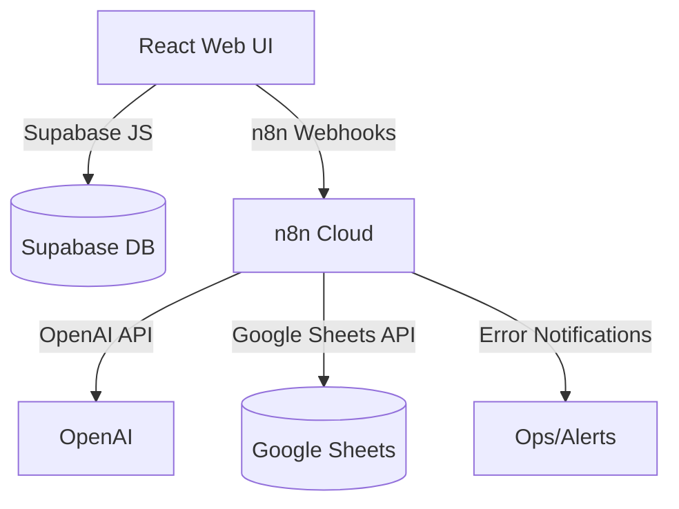

# Audit Report

## Table of Contents
- [Executive Summary](#executive-summary)
- [Top 10 Risks](#top-10-risks)
- [Architecture Map](#architecture-map)
- [Threat Model](#threat-model)

## Executive Summary
**Project**: prisma-glow-15

| Pillar | Score (0-5) | Notes |
|---|---|---|
| Security | 1 | Hard-coded Supabase keys, lack of secret management, no authentication around n8n workflows |
| Reliability | 1 | No retry/idempotency patterns, no error handling workflows |
| Observability | 0 | No logging, tracing, or alerting framework |
| Performance | 2 | Small front-end app; no server load testing or rate limiting |
| Maintainability | 2 | Large number of lint errors, no tests, no CI |
| DevEx | 2 | Minimal documentation, no local scripts for n8n flows |
| Compliance | 0 | No data retention, backup, or GDPR controls |

Overall the project is in prototype stage and requires substantial work before production deployment.

## Top 10 Risks
| Title | Impact | Likelihood | Severity | Evidence | Fix |
|---|---|---|---|---|---|
| Hard-coded Supabase credentials | High | High | Critical | `.env` and `src/integrations/supabase/client.ts` (redacted) | Move to env vars & rotate keys |
| Missing n8n workflow exports | Medium | High | High | Repository lacks workflow JSON exports | Establish workflow export & version control |
| No webhook verification | High | High | Critical | No code handling signatures or tokens | Implement verification in n8n and web layer |
| Lack of retries/backoff for external calls | Medium | High | High | No retry logic in code | Use n8n retry nodes / custom logic |
| No centralized error handling | Medium | High | High | No error workflow or logging | Build global error workflow with alerts |
| Unbounded Google Sheets operations | Medium | Medium | Medium | No batching/backoff | Use Sheets API batch updates and quotas |
| Inadequate RLS coverage for Supabase tables | High | Medium | High | Review migrations for policies | Audit policies, enforce least privilege |
| Absence of tests and CI | Medium | High | High | `npm test` missing | Add tests and CI pipeline |
| Dependency vulnerabilities | Medium | High | High | `npm audit` shows esbuild/vite vuln | Upgrade dependencies, run SCA in CI |
| No .env hygiene or secret rotation policy | Medium | High | High | Only `.env` committed, no example | Add `.env.example`, use secret manager |

## Architecture Map

## Threat Model
**Assets**: Supabase data, Google Sheets data, API keys, user PII

| STRIDE | Threat | Mitigation |
|---|---|---|
| Spoofing | Unverified webhooks could be called by attackers | Add webhook secret verification and auth tokens |
| Tampering | Lack of input validation for Sheet/AI data | Validate all inputs, use schemas |
| Repudiation | No audit logs beyond basic activity table | Enable n8n and Supabase logs |
| Information Disclosure | Hard-coded keys and PII exposure | Use secret manager and data minimization |
| Denial of Service | No rate limiting on webhooks or Sheets ops | Implement rate limiting and backoff |
| Elevation of Privilege | Weak RLS policies or missing auth checks | Review policies, enforce least privilege |

