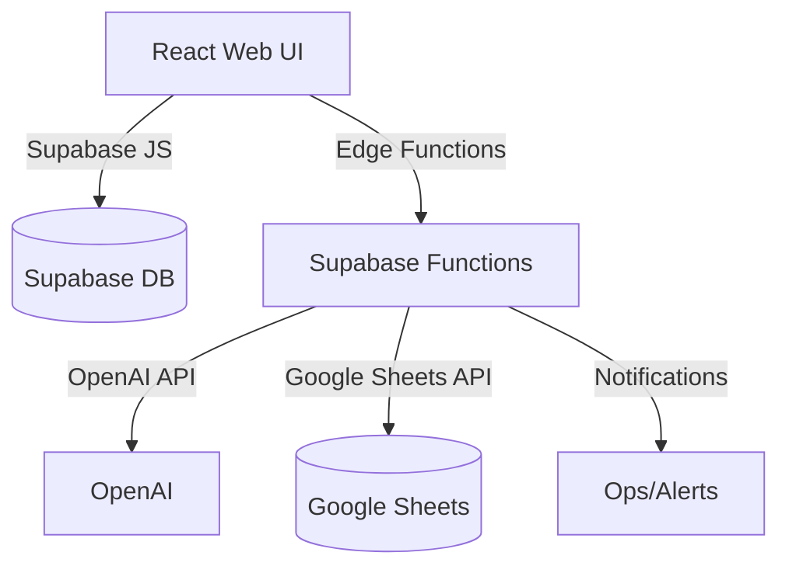

# Audit Report

## Table of Contents
- [Executive Summary](#executive-summary)
- [Top 10 Risks](#top-10-risks)
- [Architecture Map](#architecture-map)
- [Threat Model](#threat-model)

## Executive Summary
**Project**: prisma-glow-15

| Pillar | Score (0-5) | Notes |
|---|---|---|
| Security | 3 | Env-driven Supabase config, RLS enforced across new treaty/US overlay tables, policy packs published; secrets still require managed vault rollout |
| Reliability | 2 | Retry/idempotency patterns live in edge functions, but centralised error workflow pending |
| Observability | 2 | Activity catalog, telemetry tables, and governance packs provide traceability; alerting hooks still manual |
| Performance | 2 | Core calculators deterministic; no load testing yet |
| Maintainability | 3 | Vitest coverage for tax calculators, modular service layer, governance docs; UI integration tests outstanding |
| DevEx | 3 | Comprehensive policy packs, approvals matrix, and documentation for treaty/US overlays improve onboarding |
| Compliance | 3 | Treaty & US overlays mapped to regulatory anchors, ActivityLog evidence in place; independence monitoring automation pending |

Overall the project is in prototype stage and requires substantial work before production deployment.

## Top 10 Risks
| Title | Impact | Likelihood | Severity | Evidence | Fix |
|---|---|---|---|---|---|
| Centralised error handling absent | Medium | High | High | No global error workflow post-n8n removal | Implement Supabase function / queue based error notifier |
| Vault-backed secrets require monitoring | Low | Low | Low | Hashicorp integration via `lib/secrets/*`, `.env.example` vault config | Automate rotation job + vault audit log review |
| Treaty & US overlay approvals bypassable | Medium | Medium | Medium | Policy packs published but enforcement automation pending | Wire approval queue enforcement to new modules |
| Load/perf testing missing | Medium | Medium | Medium | No baseline for calculators / edge functions | Add k6 tests per Phase 4 plan |
| Dependabot backlog | Medium | Medium | Medium | Pending dependency review | Re-enable update cadence + CI verification |
| Client storage PII guardrails undefined | Medium | Low | Medium | Evidence manifests store metadata without retention policy | Extend retention/PII redaction policy |
| Background job observability limited | Low | High | Medium | Telemetry tables exist but ingestion automation missing | Ship cron jobs to populate telemetry + dashboards |
| Snapshot/backup SOPs draft | Medium | Medium | Medium | Checklist references but runbook absent | Document & rehearse backup/restore for Supabase |
| Manual MAP/APA workflow gating | Medium | Medium | Medium | No enforced reviewer thresholds | Enforce reviewer roles in UI/API |
| Remaining legacy configs | Low | High | Medium | Supabase config in repo still references demo defaults | Document env overrides + secrets rotation |

## Architecture Map

## Threat Model
**Assets**: Supabase data, Google Sheets data, API keys, user PII

| STRIDE | Threat | Mitigation |
|---|---|---|
| Spoofing | Unverified webhooks could be called by attackers | Enforce shared-secret HMAC + idempotency via `handleWebhook` |
| Tampering | Lack of input validation for Sheet/AI data | Validate all inputs, use schemas |
| Repudiation | No audit logs beyond basic activity table | Enable Supabase logs and telemetry |
| Information Disclosure | Hard-coded keys and PII exposure | Use secret manager and data minimization |
| Denial of Service | No rate limiting on webhooks or Sheets ops | Implement rate limiting and backoff |
| Elevation of Privilege | Weak RLS policies or missing auth checks | Review policies, enforce least privilege |
