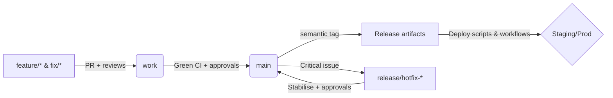

# Deployment Readiness Report

## Overview
- **Target platform:** Container hosting (Node 20 runners in CI, Node 22 locally)【F:.github/workflows/ci.yml†L20-L36】【F:package.json†L6-L35】
- **Primary app:** `apps/web` (Next.js 14 App Router) with shared tokens for Vercel previews【F:apps/web/app/style-guide/page.tsx†L1-L38】
- **Supporting services:** `apps/gateway` (Express proxy), `services/rag` (Node worker + Express APIs)【F:audit/inventory.json†L4-L46】
- **Package manager:** pnpm 9.12.3 (pinned via `packageManager` + Volta metadata)【F:package.json†L6-L24】
- **Node version alignment:** `.nvmrc` & engines pin Node 22.12.0 for developers, workflows run on 20.19.x until Vercel updates image【F:package.json†L13-L21】【F:.github/workflows/ci.yml†L20-L33】

## Branch Strategy & Approval Gates
- Baseline branches tracked in [`docs/branch-inventory.md`](docs/branch-inventory.md); `main` represents deployable state, `work` mirrors main for integration spikes.【F:docs/branch-inventory.md†L5-L10】
- Feature development occurs on `feature/*` or `fix/*` branches and merges through protected PRs requiring review and up-to-date checks.【F:docs/architecture.md†L501-L539】【F:docs/deployment/branch-protection.md†L3-L16】
- Hotfixes follow the playbook in [`docs/deployment/hotfix-operations.md`](docs/deployment/hotfix-operations.md) with manual approvals before merging back to `main`.【F:docs/deployment/hotfix-operations.md†L3-L44】
- Approval gates:
  - **Pull requests → `work`/`main`:** Require two reviewers, status checks from `Monorepo CI`, `Workspace CI`, and security scans to be green before merge (branch protection).【F:docs/architecture.md†L538-L538】【F:.github/workflows/ci.yml†L5-L74】
  - **Database migrations:** Manual approval on `prisma-migrate.yml` to target production Supabase projects.【F:.github/workflows/prisma-migrate.yml†L1-L86】

## Workflow Inventory
| Workflow | Trigger | Purpose | Key Outputs |
| --- | --- | --- | --- |
| [`ci.yml`](.github/workflows/ci.yml) | PRs & pushes to `main`, nightly cron | Root lint/typecheck/tests/build, bundle budgets, policy checks | Web build, coverage report, retention doc verification |
| [`workspace-ci.yml`](.github/workflows/workspace-ci.yml) | PRs & pushes to `main` | Turbo-powered lint/test/build per workspace + Supabase Deno tests | Validated packages, generated API types |
| [`docker-build.yml`](.github/workflows/docker-build.yml) | Pushes to `main` & version tags | Build & push multi-service images to GHCR/Docker Hub | Tagged images (`latest`, commit SHA) per service |
| [`compose-deploy.yml`](.github/workflows/compose-deploy.yml) | Manual dispatch | SSH deploy using docker compose with optional rollback tag | Remote compose stack refreshed with selected profile |
| [`prisma-migrate.yml`](.github/workflows/prisma-migrate.yml) | Manual dispatch + schedule | Apply Prisma migrations with environment-specific credentials | Database schema updated, migration status posted |
| [`supabase-migrate.yml`](.github/workflows/supabase-migrate.yml) | Manual dispatch | Apply SQL migrations to Supabase edge projects | Supabase schema synchronised |
| [`healthz-smoke.yml`](.github/workflows/healthz-smoke.yml) | Schedule & dispatch | HTTP smoke tests against deployed endpoints | Alerting if health endpoints regress |
| [`codeql.yml`](.github/workflows/codeql.yml), [`container-scan.yml`](.github/workflows/container-scan.yml), [`sbom.yml`](.github/workflows/sbom.yml) | Scheduled & PR | Security scanning, dependency SBOM publication | CodeQL alerts, Trivy/Grype scan reports, CycloneDX SBOMs |

## CI Stage Breakdown
1. **Lint & Type Safety** – `pnpm run typecheck` and `pnpm run lint` ensure TypeScript + ESLint compliance before tests run.【F:.github/workflows/ci.yml†L34-L58】
2. **Automated Tests** – Vitest coverage enforced with 45/40/45/45 thresholds; workspace jobs execute targeted tests (`gateway`, `rag`, `web`, shared packages, Supabase functions).【F:.github/workflows/ci.yml†L59-L76】【F:.github/workflows/workspace-ci.yml†L32-L93】
3. **Build Verification** – Next.js build + bundle budgets at root; Turbo pipelines build service packages to confirm production readiness.【F:.github/workflows/ci.yml†L77-L97】【F:.github/workflows/workspace-ci.yml†L42-L93】
4. **Database Smoke** – Local Postgres container receives Supabase + Prisma SQL migrations to verify order and compatibility on every run.【F:.github/workflows/ci.yml†L79-L140】
5. **OpenAPI Client Generation** – Ensures API contract drift detection via `codegen:api` job gated by earlier stages.【F:.github/workflows/ci.yml†L141-L189】

## Semantic-release & Version Management
- **Current state:** Release managers still tag versions manually (`git tag -a vX.Y.Z`) per the release runbook; this step precedes `docker-build` so images receive semantic tags.【F:docs/release-runbook.md†L59-L103】
- **Target automation:** Integrate `semantic-release` as a dedicated workflow to replace manual tagging:
  - Detect conventional commits, determine next semver, publish GitHub release notes.
  - Emit annotated tags that automatically trigger `docker-build.yml` and downstream compose deployments.
  - Use a dry-run on PRs via `semantic-release --dry-run` to surface release notes before merge.
- **Action items:** Add `semantic-release` config + CI job; until then, document manual tagging in PR descriptions so reviewers can validate changelog impact. Status tracked in this report to avoid drift.

## Deployment Scripts & Environment Promotion
- Environment promotion flow:
  1. **Preview / QA:** Feature branches deployed to temporary environments (Vercel previews + optional docker compose). Smoke tested via `healthz-smoke.yml` before merge.【F:.github/workflows/healthz-smoke.yml†L1-L78】
  2. **Staging:** Images tagged with commit SHA pulled onto staging hosts using `compose-deploy.yml` (`profile=web`) and Supabase migrations applied with staging credentials.【F:.github/workflows/compose-deploy.yml†L1-L64】【F:.github/workflows/prisma-migrate.yml†L35-L86】
  3. **Production:** After manual approval, rerun compose deploy with production secrets and, if needed, `scripts/deploy/trigger_prisma_migrate.sh` for Prisma migrations.【F:scripts/deploy/trigger_prisma_migrate.sh†L1-L74】
- Promotion checkpoints are mirrored in [`docs/deployment/prisma-supabase-deployment.md`](docs/deployment/prisma-supabase-deployment.md) covering Supabase, gateway ingress, and RAG placement.【F:docs/deployment/prisma-supabase-deployment.md†L16-L92】
- Makefile helpers (`compose-prod-up`, `compose-prod-set-tag`) streamline local-to-remote parity and align with the SSH deploy workflow for quick rollback.【F:Makefile†L1-L68】

## Secrets & Credentials
- **CI secrets:** `STAGING_DATABASE_URL` for policy tests; optional `DOCKERHUB_USERNAME/TOKEN` for cross-publishing images; GitHub token for GHCR push.【F:.github/workflows/ci.yml†L78-L109】【F:.github/workflows/docker-build.yml†L33-L77】
- **Deployment secrets:** `DEPLOY_HOST`, `DEPLOY_USER`, `DEPLOY_SSH_KEY`, `COMPOSE_ENV` (base64’d env file) required by `compose-deploy` workflow.【F:.github/workflows/compose-deploy.yml†L23-L57】
- **Service config:** Supabase, Keycloak, OpenAI, telemetry, and Redis credentials validated via runtime loaders (`apps/web/src/env.server.ts`, `apps/gateway/src/env.ts`, `services/rag/env.ts`).【F:apps/web/src/env.server.ts†L1-L120】【F:apps/gateway/src/env.ts†L1-L146】【F:services/rag/env.ts†L1-L130】
- **GitHub Environments:** Use `pnpm openai:file-search:secrets` to populate vector store IDs and ensure parity across staging/production.【F:scripts/operations/publish-openai-file-search-secrets.ts†L1-L148】

## Manual Interventions & Approval Points
- **Database changes:** Human review required before invoking `supabase-migrate` or `prisma-migrate` production jobs; staging runs may be automated but still notify DB owner.【F:.github/workflows/prisma-migrate.yml†L35-L86】【F:.github/workflows/supabase-migrate.yml†L27-L88】
- **Compose deploy:** Workflow dispatch expects operator to choose profile + optional rollback tag; typically executed by release manager after staging verification.【F:.github/workflows/compose-deploy.yml†L1-L64】
- **Hotfix lifecycle:** `pnpm hotfix:manage` CLI from [`docs/OPERATIONS/hotfix-release-branch-runbook.md`](docs/OPERATIONS/hotfix-release-branch-runbook.md) guides branch creation, approvals, and retirement.【F:docs/OPERATIONS/hotfix-release-branch-runbook.md†L4-L47】
- **Security gates:** CodeQL, container scan, and SBOM workflows must pass before releases are signed off according to the release runbook.【F:docs/release-runbook.md†L70-L95】【F:.github/workflows/codeql.yml†L1-L132】

## Rollback Procedures
- **Application rollback:** Use `compose-deploy.yml` with `rollback_tag` or locally run `make compose-prod-rollback ROLLBACK_TAG=<sha>` to reset image tags, then restart services.【F:.github/workflows/compose-deploy.yml†L42-L64】【F:Makefile†L50-L68】
- **Database rollback:** Follow Supabase point-in-time restore dry-run guidance in [`docs/OPERATIONS/observability-checklist.md`](docs/OPERATIONS/observability-checklist.md) before executing production restores.【F:docs/OPERATIONS/observability-checklist.md†L12-L34】
- **Hotfix revert:** Merge `release/hotfix-*` back into `main`, delete temporary branch once stability confirmed, and redeploy latest tag per hotfix runbook.【F:docs/deployment/hotfix-operations.md†L36-L44】【F:docs/OPERATIONS/hotfix-release-branch-runbook.md†L38-L47】

## Environment Status
- Variable matrices recorded in [`audit/env-matrix.csv`](audit/env-matrix.csv) with drift alerts maintained via runtime validators listed above.【F:audit/env-matrix.csv†L1-L40】【F:apps/web/src/env.server.ts†L1-L120】
- `.env.example` files ship alongside each workspace to align local/staging/production expectations.【F:apps/web/.env.example†L1-L120】【F:apps/gateway/.env.example†L1-L80】【F:services/rag/.env.example†L1-L95】
- RAG deployments require `OPENAI_FILE_SEARCH_VECTOR_STORE_ID` plus optional overrides; populate secrets with `pnpm openai:file-search:secrets` prior to rollout.【F:scripts/operations/publish-openai-file-search-secrets.ts†L1-L148】

## Inventory Snapshot
See [`audit/inventory.json`](audit/inventory.json) for machine-readable service metadata, build commands, and dependencies.【F:audit/inventory.json†L1-L70】

## Vercel UI Readiness
- Shared `PageShell` + `PageHeader` wrappers keep App Router surfaces consistent across preview and production deployments.【F:apps/web/app/dashboard/page.tsx†L1-L42】
- `/agent-chat` and associated playgrounds align with design tokens to minimise diff noise during preview QA.【F:apps/web/app/agent-chat/page.tsx†L1-L160】

## Risks & Follow-ups
- `services/rag` feature flags depend on OpenAI/Supabase secrets; ensure environments are provisioned before toggling advanced retrieval features.【F:services/rag/env.ts†L1-L130】
- Prisma migrations remain operator-triggered; continue to run `pnpm --filter web prisma:migrate:deploy` (or dispatch workflow) when schema changes ship.【F:docs/release-runbook.md†L94-L118】
- Gateway tests mutate env overrides; confirm secrets exist prior to scaling production traffic to avoid runtime boot failures.【F:apps/gateway/src/env.ts†L1-L146】
- **Semantic-release adoption:** Documented above; backlog item to replace manual tagging so automation stays source of truth.

## Status Summary
| Component | Status | Notes |
| --- | --- | --- |
| `apps/web` | 🟢 Ready | Validated env schema, CI parity, compose deployment path defined. |
| `apps/gateway` | 🟡 External Deploy | Env validator + CI coverage solid; production ingress decision pending. |
| `services/rag` | 🟡 External Deploy | Requires sustained worker infra and confirmed secret injection before go-live. |
