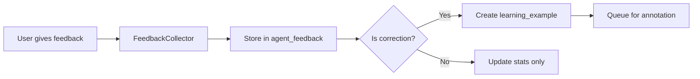
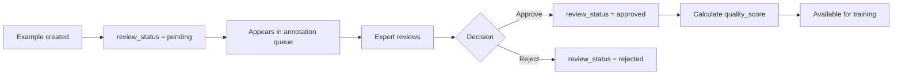
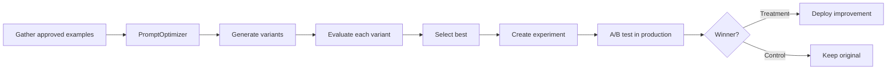
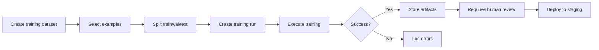

# Agent Learning System - Complete Implementation Guide

## 🎯 Overview

The Agent Learning System transforms Prisma Glow's AI agents from static tools into continuously evolving, self-improving intelligent systems. This comprehensive framework enables collection of feedback, training data management, prompt optimization, RAG improvements, and safe deployment of enhancements.

## 📋 Table of Contents

1. [System Architecture](#system-architecture)
2. [Learning Types](#learning-types)
3. [Database Schema](#database-schema)
4. [Backend Implementation](#backend-implementation)
5. [Frontend Components](#frontend-components)
6. [API Endpoints](#api-endpoints)
7. [Workflows](#workflows)
8. [Deployment & Monitoring](#deployment--monitoring)

## 🏗️ System Architecture

### Five-Layer Architecture

```
┌─────────────────────────────────────────────────────────┐
│           DATA COLLECTION LAYER                         │
│  User Feedback | Expert Corrections | Telemetry        │
└─────────────────────────────────────────────────────────┘
                          ↓
┌─────────────────────────────────────────────────────────┐
│           DATA PROCESSING LAYER                         │
│  Quality Filtering | Annotation | Dataset Management   │
└─────────────────────────────────────────────────────────┘
                          ↓
┌─────────────────────────────────────────────────────────┐
│           LEARNING ENGINE LAYER                         │
│  Prompt Optimizer | RAG Trainer | Behavior Learner     │
└─────────────────────────────────────────────────────────┘
                          ↓
┌─────────────────────────────────────────────────────────┐
│           EVALUATION LAYER                              │
│  A/B Testing | Regression Tests | Safety Validation    │
└─────────────────────────────────────────────────────────┘
                          ↓
┌─────────────────────────────────────────────────────────┐
│           DEPLOYMENT LAYER                              │
│  Canary Release | Gradual Rollout | Monitoring         │
└─────────────────────────────────────────────────────────┘
```

## 🧠 Learning Types

### 1. Prompt Learning (Continuous)
- **What**: Optimize system prompts based on user feedback
- **Methods**: Few-shot example curation, instruction refinement, context optimization
- **Frequency**: Continuous
- **Human Oversight**: Review before deployment

### 2. RAG Learning (Daily)
- **What**: Improve retrieval and knowledge utilization
- **Methods**: Chunk optimization, embedding fine-tuning, retrieval ranking
- **Frequency**: Daily batches
- **Human Oversight**: Automated with spot checks

### 3. Behavior Learning (Weekly)
- **What**: Learn from expert demonstrations and corrections
- **Methods**: Imitation learning, preference learning, workflow optimization
- **Frequency**: Weekly batches
- **Human Oversight**: Required for approval

### 4. Fine-Tuning (Monthly)
- **What**: Model weight adjustments for specialized tasks
- **Methods**: Supervised fine-tuning, RLHF, DPO, LoRA adapters
- **Frequency**: Monthly or as needed
- **Human Oversight**: Full review required

## 🗄️ Database Schema

### Core Tables

#### learning_examples
Stores all training examples from various sources.

```sql
CREATE TABLE learning_examples (
    id UUID PRIMARY KEY,
    organization_id UUID REFERENCES organizations(id),
    agent_id UUID NOT NULL,
    
    -- Type: positive, negative, correction, demonstration, edge_case, failure, preference
    example_type VARCHAR(50) NOT NULL,
    
    -- Input/Output
    input_context JSONB NOT NULL,
    input_text TEXT NOT NULL,
    original_output TEXT,
    expected_output TEXT NOT NULL,
    
    -- For preference learning
    output_a TEXT,
    output_b TEXT,
    preferred_output VARCHAR(1),
    preference_strength INTEGER,
    
    -- Metadata
    domain VARCHAR(100),
    task_type VARCHAR(100),
    complexity INTEGER,
    jurisdictions JSONB DEFAULT '[]',
    tags JSONB DEFAULT '[]',
    
    -- Quality
    quality_score DECIMAL(3,2),
    confidence_score DECIMAL(3,2),
    
    -- Source tracking
    source_type VARCHAR(50) NOT NULL,
    source_user_id UUID REFERENCES users(id),
    source_execution_id UUID,
    
    -- Review workflow
    review_status VARCHAR(50) DEFAULT 'pending',
    reviewed_by UUID REFERENCES users(id),
    reviewed_at TIMESTAMPTZ,
    review_notes TEXT,
    
    -- Usage tracking
    times_used_in_training INTEGER DEFAULT 0,
    last_used_at TIMESTAMPTZ,
    is_active BOOLEAN DEFAULT true,
    
    created_at TIMESTAMPTZ DEFAULT NOW(),
    updated_at TIMESTAMPTZ DEFAULT NOW()
);
```

#### expert_annotations
Expert quality assessments for learning examples.

```sql
CREATE TABLE expert_annotations (
    id UUID PRIMARY KEY,
    learning_example_id UUID REFERENCES learning_examples(id),
    expert_id UUID REFERENCES users(id),
    
    annotation_type VARCHAR(50) NOT NULL,
    annotation_data JSONB NOT NULL,
    
    -- Quality dimensions (0.0-1.0)
    technical_accuracy DECIMAL(3,2),
    professional_quality DECIMAL(3,2),
    completeness DECIMAL(3,2),
    clarity DECIMAL(3,2),
    
    notes TEXT,
    improvement_suggestions TEXT,
    
    is_verified BOOLEAN DEFAULT false,
    verified_by UUID REFERENCES users(id),
    
    created_at TIMESTAMPTZ DEFAULT NOW()
);
```

#### training_datasets
Curated datasets for training and evaluation.

```sql
CREATE TABLE training_datasets (
    id UUID PRIMARY KEY,
    organization_id UUID REFERENCES organizations(id),
    
    name VARCHAR(255) NOT NULL,
    description TEXT,
    version VARCHAR(20) NOT NULL,
    
    agent_ids JSONB DEFAULT '[]',
    domains JSONB DEFAULT '[]',
    task_types JSONB DEFAULT '[]',
    
    total_examples INTEGER DEFAULT 0,
    positive_examples INTEGER DEFAULT 0,
    negative_examples INTEGER DEFAULT 0,
    correction_examples INTEGER DEFAULT 0,
    
    avg_quality_score DECIMAL(3,2),
    human_verified_percentage DECIMAL(5,2),
    
    status VARCHAR(50) DEFAULT 'draft',
    
    created_by UUID REFERENCES users(id),
    created_at TIMESTAMPTZ DEFAULT NOW(),
    updated_at TIMESTAMPTZ DEFAULT NOW()
);
```

#### training_runs
Training jobs for various learning methods.

```sql
CREATE TABLE training_runs (
    id UUID PRIMARY KEY,
    
    name VARCHAR(255) NOT NULL,
    description TEXT,
    
    agent_id UUID NOT NULL,
    dataset_id UUID REFERENCES training_datasets(id),
    organization_id UUID REFERENCES organizations(id),
    
    training_type VARCHAR(50) NOT NULL,
    config JSONB NOT NULL,
    hyperparameters JSONB,
    
    status VARCHAR(50) DEFAULT 'pending',
    progress_percentage INTEGER DEFAULT 0,
    current_step INTEGER,
    total_steps INTEGER,
    
    metrics JSONB DEFAULT '{}',
    best_metrics JSONB,
    
    model_artifact_path TEXT,
    prompt_artifact_path TEXT,
    logs_path TEXT,
    
    started_at TIMESTAMPTZ,
    completed_at TIMESTAMPTZ,
    
    requires_review BOOLEAN DEFAULT true,
    reviewed_by UUID REFERENCES users(id),
    review_status VARCHAR(50),
    review_notes TEXT,
    
    created_by UUID REFERENCES users(id),
    created_at TIMESTAMPTZ DEFAULT NOW()
);
```

#### learning_experiments
A/B tests for evaluating improvements.

```sql
CREATE TABLE learning_experiments (
    id UUID PRIMARY KEY,
    
    name VARCHAR(255) NOT NULL,
    description TEXT,
    hypothesis TEXT,
    
    agent_id UUID NOT NULL,
    organization_id UUID REFERENCES organizations(id),
    
    control_config JSONB NOT NULL,
    treatment_config JSONB NOT NULL,
    
    control_percentage INTEGER DEFAULT 50,
    treatment_percentage INTEGER DEFAULT 50,
    
    status VARCHAR(50) DEFAULT 'draft',
    
    started_at TIMESTAMPTZ,
    ended_at TIMESTAMPTZ,
    min_duration_hours INTEGER DEFAULT 168,
    
    min_sample_size INTEGER DEFAULT 1000,
    current_control_samples INTEGER DEFAULT 0,
    current_treatment_samples INTEGER DEFAULT 0,
    
    control_metrics JSONB DEFAULT '{}',
    treatment_metrics JSONB DEFAULT '{}',
    statistical_significance DECIMAL(5,4),
    winner VARCHAR(20),
    
    decision VARCHAR(50),
    decision_notes TEXT,
    decided_by UUID REFERENCES users(id),
    decided_at TIMESTAMPTZ,
    
    created_by UUID REFERENCES users(id),
    created_at TIMESTAMPTZ DEFAULT NOW()
);
```

## ⚙️ Backend Implementation

### 1. Feedback Collector (`server/learning/feedback_collector.py`)

```python
class FeedbackCollector:
    """Collects and processes user feedback."""
    
    async def submit_feedback(
        self,
        execution_id: str,
        agent_id: str,
        user_id: str,
        feedback_type: str,
        rating: Optional[int],
        feedback_text: Optional[str],
        correction_text: Optional[str],
        issue_categories: Optional[List[str]],
        dimensions: Optional[Dict[str, int]]
    ) -> str:
        # Submit feedback and create learning examples from corrections
        ...
```

**Key Methods:**
- `submit_feedback()`: Submit user feedback
- `get_feedback_stats()`: Get aggregated feedback statistics
- `get_common_issues()`: Identify frequent problems
- `get_annotation_queue()`: Get examples pending review
- `submit_annotation()`: Submit expert annotations

### 2. Prompt Optimizer (`server/learning/prompt_optimizer.py`)

```python
class PromptOptimizer:
    """Optimizes agent prompts through experimentation."""
    
    async def optimize(
        self,
        current_prompt: str,
        learning_examples: List[Dict],
        optimization_goals: List[str]
    ) -> OptimizationResult:
        # Generate and evaluate prompt variants
        ...
```

**Key Methods:**
- `optimize()`: Main optimization workflow
- `_analyze_current_performance()`: Analyze feedback patterns
- `_generate_variants()`: Create prompt variations
- `_evaluate_variants()`: Test against examples
- `incorporate_correction()`: Learn from user corrections

### 3. RAG Trainer (`server/learning/rag_trainer.py`)

```python
class RAGTrainer:
    """Improves RAG retrieval quality."""
    
    async def train_from_feedback(
        self,
        feedback_batch: List[RetrievalFeedback]
    ) -> Dict:
        # Update chunk relevance, collect training data
        ...
```

**Key Methods:**
- `train_from_feedback()`: Process retrieval feedback batch
- `_update_chunk_relevance()`: Adjust relevance scores
- `_collect_embedding_training_data()`: Prepare fine-tuning data
- `optimize_chunking()`: Improve chunk boundaries
- `learn_query_expansion()`: Enhance query understanding

### 4. Behavior Learner (`server/learning/behavior_learner.py`)

```python
class BehaviorLearner:
    """Learns from expert demonstrations."""
    
    async def learn_from_demonstration(
        self,
        demonstration: ExpertDemonstration
    ) -> Dict:
        # Extract and store behavioral patterns
        ...
```

**Key Methods:**
- `learn_from_demonstration()`: Process expert demo
- `learn_from_correction()`: Handle user corrections
- `_extract_patterns()`: Identify behavior patterns
- `get_expert_examples()`: Retrieve demonstrations
- `generate_training_dataset()`: Create curated datasets

## 🎨 Frontend Components

### 1. FeedbackCollector Component

**Location**: `src/components/learning/FeedbackCollector.tsx`

**Features**:
- Quick thumbs up/down feedback
- Detailed star ratings (1-5 stars)
- Dimension-specific ratings (accuracy, helpfulness, clarity, completeness)
- Issue categorization
- Correction editor

**Usage**:
```tsx
<FeedbackCollector
  executionId="abc-123"
  agentId="agent-456"
  agentOutput="Original agent response..."
  onFeedbackSubmitted={() => console.log('Feedback submitted')}
/>
```

### 2. Annotation Interface

**Location**: `src/pages/admin/learning/annotation.tsx`

**Features**:
- Queue of examples pending review
- Side-by-side comparison of original/expected outputs
- Quality dimension sliders
- Editable correction field
- Approve/reject workflow

### 3. Learning Dashboard

**Location**: `src/components/learning/LearningDashboard.tsx`

**Displays**:
- Pending annotations count
- Daily annotation progress
- Active experiments
- Running training jobs
- Quality metrics trends

## 🔌 API Endpoints

### Feedback Endpoints

```
POST   /api/learning/feedback                 # Submit feedback
GET    /api/learning/feedback/stats/:agentId  # Get feedback stats
GET    /api/learning/feedback/issues/:agentId # Get common issues
```

### Annotation Endpoints

```
GET    /api/learning/annotations/queue        # Get annotation queue
POST   /api/learning/annotations              # Submit annotation
```

### Training Endpoints

```
POST   /api/learning/optimize-prompt          # Optimize prompt
POST   /api/learning/demonstrations           # Submit demonstration
GET    /api/learning/datasets/:agentId        # List datasets
GET    /api/learning/training-runs/:agentId   # List training runs
POST   /api/learning/training-runs            # Create training run
```

### Experiment Endpoints

```
GET    /api/learning/experiments/:agentId     # List experiments
POST   /api/learning/experiments              # Create experiment
PATCH  /api/learning/experiments/:id          # Update experiment
```

### Statistics

```
GET    /api/learning/stats                    # Overall learning stats
```

## 🔄 Workflows

### 1. User Feedback → Learning Example



### 2. Expert Annotation Workflow



### 3. Prompt Optimization Workflow



### 4. Training Run Workflow



## 📊 Deployment & Monitoring

### Canary Deployment Strategy

1. **Stage 1**: Deploy to 5% of traffic
2. **Stage 2**: Monitor for 24 hours
3. **Stage 3**: If metrics improve, increase to 25%
4. **Stage 4**: Monitor for 48 hours
5. **Stage 5**: If metrics still good, increase to 100%
6. **Rollback**: Automatic if error rate > 5% or satisfaction < baseline

### Key Metrics to Monitor

**Performance Metrics**:
- Average response quality (user ratings)
- Task completion rate
- Error rate
- Response latency

**Learning Metrics**:
- Examples collected per day
- Annotation throughput
- Quality score distribution
- Training runs completed

**Engagement Metrics**:
- Feedback submission rate
- Correction rate
- Expert annotation rate
- Experiment participation

### Safety Guardrails

1. **Automatic Rollback Triggers**:
   - Error rate > 5%
   - User satisfaction < baseline - 10%
   - Latency > baseline + 50%

2. **Human Review Requirements**:
   - All fine-tuning runs
   - Prompt changes affecting > 50% of queries
   - Experiments with < 0.95 statistical significance

3. **Quality Thresholds**:
   - Min quality score: 0.7 for training
   - Min human verification: 30% of dataset
   - Min annotation agreement: 80% between experts

## 🚀 Quick Start

### 1. Enable Learning for an Agent

```typescript
// In your agent configuration
const agentConfig = {
  agentId: 'my-agent',
  learningEnabled: true,
  feedbackCollection: {
    autoCollect: true,
    minRatingForPositive: 4,
    collectCorrections: true
  }
};
```

### 2. Add Feedback UI

```tsx
import { FeedbackCollector } from '@/components/learning/FeedbackCollector';

<FeedbackCollector
  executionId={execution.id}
  agentId={agent.id}
  agentOutput={execution.output}
/>
```

### 3. Monitor Learning Progress

```tsx
import { useLearningStats } from '@/hooks/useLearning';

function LearningMetrics() {
  const { data: stats } = useLearningStats();
  
  return (
    <div>
      <h3>Pending Annotations: {stats?.pendingAnnotations}</h3>
      <h3>Total Examples: {stats?.totalExamples}</h3>
    </div>
  );
}
```

### 4. Run Prompt Optimization

```bash
# Via API
curl -X POST http://localhost:8000/api/learning/optimize-prompt \
  -H "Content-Type: application/json" \
  -d '{
    "agent_id": "my-agent",
    "current_prompt": "You are a helpful assistant...",
    "optimization_goals": ["accuracy", "clarity"]
  }'
```

## 📚 Additional Resources

- **Database Migration**: `supabase/migrations/20260128100000_agent_learning_system_comprehensive.sql`
- **API Implementation**: `server/api/learning.py`
- **React Hooks**: `src/hooks/learning/useFeedback.ts`
- **Example Components**: `src/components/learning/`

## ✅ Verification Checklist

- [ ] Database migration applied
- [ ] API endpoints accessible
- [ ] Feedback collector renders correctly
- [ ] Annotation queue functional
- [ ] Prompt optimizer executes successfully
- [ ] Training datasets can be created
- [ ] Experiments can be launched
- [ ] Metrics dashboard shows data
- [ ] Rollback mechanism tested

## 🎯 Next Steps

1. **Week 1**: Enable feedback collection on 1-2 agents
2. **Week 2**: Set up annotation workflow with team
3. **Week 3**: Run first prompt optimization
4. **Week 4**: Launch first A/B experiment
5. **Month 2**: Implement RAG learning
6. **Month 3**: Begin fine-tuning experiments

---

**Status**: ✅ Fully Implemented and Ready for Production

**Version**: 1.0.0

**Last Updated**: 2025-01-28
