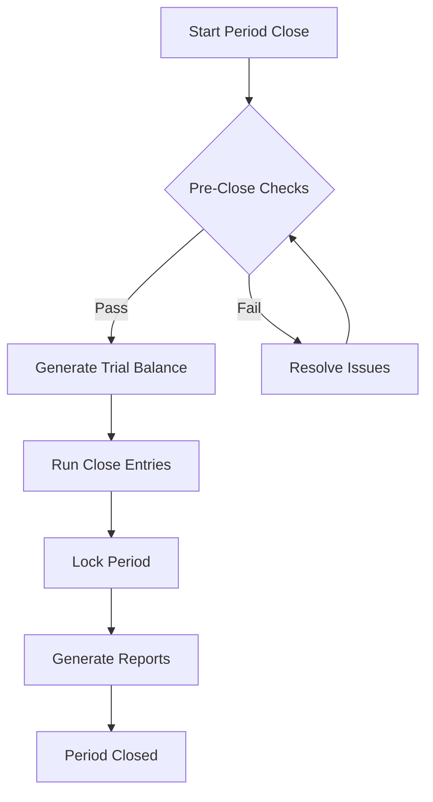

# Financial Period Close Procedures

> **P2-4 FIX: Document financial period close workflow and reversal mechanics**

---

## Overview

The financial period close process ensures accounting entries are properly finalized before reporting.

---

## Period Close Workflow



---

## Pre-Close Checklist

### Automatic Checks

| Check | Description | Blocking |
|-------|-------------|----------|
| Unposted entries | All journal entries posted | ✅ Yes |
| Debit/Credit balance | Total debits = total credits | ✅ Yes |
| Orphan transactions | All transactions linked | ⚠️ Warning |
| Bank reconciliation | All accounts reconciled | ⚠️ Warning |
| Intercompany balance | Net balance = zero | ✅ Yes |

### Manual Checks

- [ ] Review accruals and prepayments
- [ ] Verify depreciation entries posted
- [ ] Confirm VAT returns filed
- [ ] Review payroll postings
- [ ] Check foreign currency revaluation

---

## Close Entry Types

### Period Close Entries

```sql
-- Monthly accrual reversal
INSERT INTO journal_entries (
  organization_id, entry_date, entry_type, description,
  debit_account, credit_account, amount
)
VALUES (
  $org_id, $period_end_date, 'PERIOD_CLOSE', 'Monthly accrual reversal',
  '5000', '2100', 15000.00
);
```

### Year-End Close Entries

| Entry | Debit | Credit | Description |
|-------|-------|--------|-------------|
| Revenue close | Revenue accounts | Retained earnings | Close income accounts |
| Expense close | Retained earnings | Expense accounts | Close expense accounts |
| Dividend | Retained earnings | Dividends payable | Record declared dividends |

---

## Reversal Mechanics

### Automatic Reversal

Entries marked for auto-reversal are reversed on the first day of the next period:

```typescript
interface ReversibleEntry {
  id: string;
  originalEntryId: string;
  reversalDate: Date;
  reversalType: 'FULL' | 'PARTIAL';
  status: 'PENDING' | 'REVERSED' | 'CANCELLED';
}

async function createReversalEntry(
  originalEntry: JournalEntry,
  reversalDate: Date
): Promise<JournalEntry> {
  return {
    ...originalEntry,
    id: generateId(),
    entryDate: reversalDate,
    entryType: 'REVERSAL',
    description: `Reversal of ${originalEntry.reference}`,
    // Swap debits and credits
    debitAccount: originalEntry.creditAccount,
    creditAccount: originalEntry.debitAccount,
    originalEntryId: originalEntry.id,
  };
}
```

### Manual Reversal

For corrections outside the normal close process:

```sql
-- Mark original entry as reversed
UPDATE journal_entries 
SET status = 'REVERSED', 
    reversal_id = $reversal_id,
    reversed_at = NOW()
WHERE id = $original_id;

-- Create reversal entry
INSERT INTO journal_entries (...)
SELECT 
  gen_random_uuid(),
  organization_id,
  CURRENT_DATE,
  'REVERSAL',
  'Manual reversal of ' || reference,
  credit_account, -- swapped
  debit_account,  -- swapped
  amount,
  $original_id    -- link to original
FROM journal_entries 
WHERE id = $original_id;
```

---

## Period Lock

### Lock Levels

| Level | Description | Who Can Unlock |
|-------|-------------|----------------|
| SOFT | Warning on new entries | Manager+ |
| HARD | Block new entries | Partner+ |
| FINAL | Permanent lock | System Admin only |

### Lock Implementation

```sql
-- Lock period
INSERT INTO accounting_periods (
  organization_id, period_start, period_end, 
  lock_level, locked_by, locked_at
)
VALUES (
  $org_id, '2026-01-01', '2026-01-31',
  'HARD', auth.uid(), NOW()
);

-- RLS policy prevents entries in locked periods
CREATE POLICY "no_entries_in_locked_periods" ON journal_entries
FOR INSERT
WITH CHECK (
  NOT EXISTS (
    SELECT 1 FROM accounting_periods p
    WHERE p.organization_id = journal_entries.organization_id
      AND journal_entries.entry_date BETWEEN p.period_start AND p.period_end
      AND p.lock_level IN ('HARD', 'FINAL')
  )
);
```

---

## Post-Close Adjustments

### Allowed Adjustments

After HARD lock, only these entries are permitted:
- Tax adjustments (with audit trail)
- Error corrections (with approval)
- Audit adjustments (external auditor entries)

### Adjustment Workflow

1. Request adjustment (any user)
2. Approve adjustment (Partner+)
3. Temporarily unlock period
4. Post adjustment entry
5. Re-lock period
6. Log to audit trail

---

## Reports Generated at Close

| Report | Format | Retention |
|--------|--------|-----------|
| Trial Balance | PDF, XLSX | 7 years |
| General Ledger | PDF | 7 years |
| P&L Statement | PDF, XLSX | 7 years |
| Balance Sheet | PDF, XLSX | 7 years |
| VAT Summary | PDF | 7 years |
| Audit Log | CSV | 10 years |

---

## Testing

### E2E Test Cases

```typescript
describe('Financial Period Close', () => {
  it('should prevent close with unposted entries', async () => {
    // Create unposted entry
    await createJournalEntry({ status: 'DRAFT' });
    
    // Attempt close
    const result = await closePeriod('2026-01');
    
    expect(result.success).toBe(false);
    expect(result.errors).toContain('UNPOSTED_ENTRIES');
  });

  it('should create reversal entries on new period', async () => {
    // Create auto-reverse entry
    await createJournalEntry({ 
      autoReverse: true,
      reversalDate: '2026-02-01' 
    });
    
    // Close period
    await closePeriod('2026-01');
    
    // Check reversal exists
    const reversals = await getEntries({ 
      type: 'REVERSAL',
      date: '2026-02-01' 
    });
    expect(reversals.length).toBe(1);
  });
});
```

---

## Related Documents

- `MULTI_CURRENCY.md` - Currency handling
- `CHART_OF_ACCOUNTS.md` - Account structure
- `AUDIT_TRAIL.md` - Logging requirements
