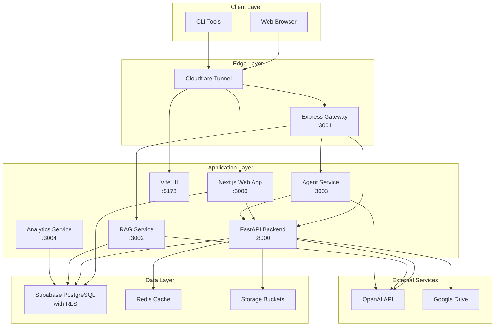
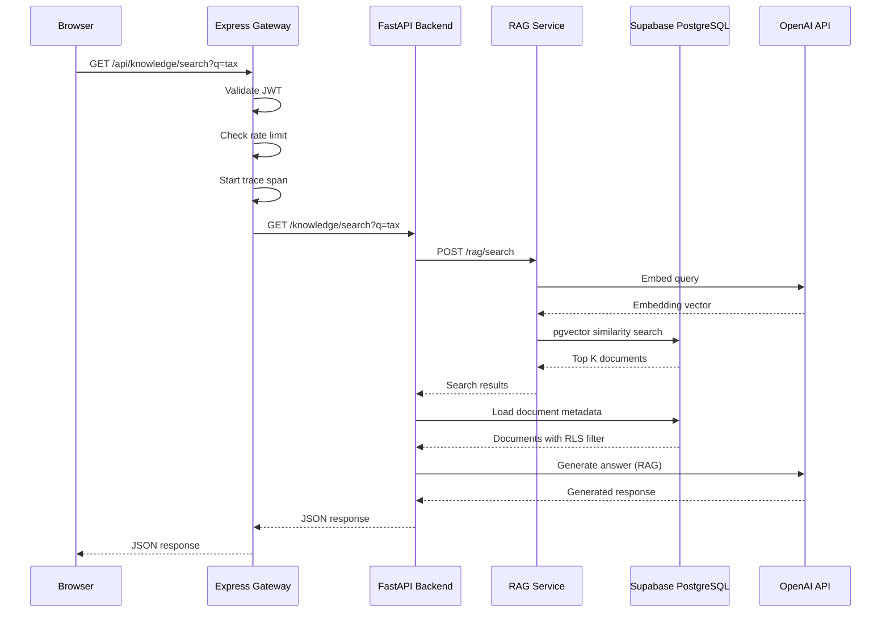
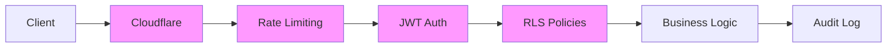

# Prisma Glow Architecture

## Table of Contents
- [Overview](#overview)
- [Architectural Principles](#architectural-principles)
- [System Architecture](#system-architecture)
- [Module Structure](#module-structure)
- [Data Flow](#data-flow)
- [Security Architecture](#security-architecture)
- [Deployment Architecture](#deployment-architecture)
- [Module Ownership](#module-ownership)
- [Architectural Decision Records](#architectural-decision-records)

## Overview

Prisma Glow is a modern AI-powered operations suite built as a **monorepo workspace** using pnpm. The system follows **layered architecture** principles with clear separation of concerns across domain, application, infrastructure, and presentation layers.

### Technology Stack

| Layer | Technologies |
|-------|-------------|
| **Frontend** | React 18 + Vite (legacy UI), Next.js 14 (apps/web) |
| **Backend** | FastAPI (Python 3.11+), Express.js (API Gateway) |
| **Database** | PostgreSQL 15 via Supabase, Prisma ORM |
| **AI/RAG** | OpenAI GPT-4/5, text-embedding-3-small, pgvector |
| **Infrastructure** | Docker Compose, Cloudflare Tunnel, GitHub Actions |
| **Observability** | OpenTelemetry, Sentry, structured logging |

### Key Metrics
- **Repository Size**: ~1,700 npm packages across 15 workspace packages
- **Services**: 6 containerized services (gateway, rag, agent, analytics, ui, web)
- **Test Coverage Target**: ≥80% (current: 45% with enforcement gates at 45/40/45/45)
- **Build Tool**: pnpm 9.12.3 with Turbo caching
- **Node Version**: 22.12.0 (CI: 20.19.4)
- **Python Version**: 3.11+

## Architectural Principles

### 1. Layered Architecture

The codebase follows clean architecture with strict dependency rules:

```
┌─────────────────────────────────────────┐
│         Presentation Layer              │
│  (UI Components, API Routes, CLI)       │
├─────────────────────────────────────────┤
│        Application Layer                │
│   (Services, Use Cases, Workflows)      │
├─────────────────────────────────────────┤
│          Domain Layer                   │
│  (Entities, Business Logic, Ports)      │
├─────────────────────────────────────────┤
│       Infrastructure Layer              │
│  (Database, External APIs, File I/O)    │
└─────────────────────────────────────────┘
```

**Dependency Rules:**
- **Domain** depends on nothing (pure business logic)
- **Application** depends on Domain
- **Infrastructure** depends on Domain (implements ports)
- **Presentation** depends on Application and Domain

### 2. Monorepo Organization

The workspace uses **feature-oriented** packages for backend services and **domain-driven** modules for shared libraries:

```
prisma/
├── apps/              # Applications (entry points)
│   ├── gateway/       # Express.js API gateway
│   └── web/           # Next.js web application
├── services/          # Domain services
│   └── rag/           # RAG embedding & search service
├── packages/          # Shared libraries
│   ├── api-client/    # TypeScript client (generated from OpenAPI)
│   ├── system-config/ # Configuration management
│   ├── logger/        # Structured logging
│   ├── agents/        # AI agent definitions
│   ├── platform/      # Platform utilities
│   └── ui/            # Shared UI components
├── server/            # FastAPI backend
│   ├── api/           # REST endpoints
│   ├── workflows/     # Business workflows
│   └── main.py        # Application entry point
└── src/               # Legacy Vite UI components
```

### 3. Ports and Adapters (Hexagonal Architecture)

External integrations follow the **ports and adapters** pattern:

- **Ports**: Interfaces defined in domain (e.g., `IKnowledgeRepository`, `IEmbeddingService`)
- **Adapters**: Implementations in infrastructure (e.g., `SupabaseKnowledgeRepository`, `OpenAIEmbeddingService`)

This enables:
- Easy testing with mock implementations
- Swappable infrastructure (e.g., switch from OpenAI to Anthropic)
- Clear dependency boundaries

## System Architecture

### High-Level Component Diagram



### Service Responsibilities

| Service | Port | Responsibilities | Dependencies |
|---------|------|-----------------|--------------|
| **Gateway** | 3001 | API routing, auth forwarding, rate limiting, tracing | FastAPI, RAG, Agent |
| **Web App** | 3000 | Next.js UI, server actions, Prisma client | Supabase, FastAPI |
| **Legacy UI** | 5173 | Vite React UI (being phased out) | Gateway |
| **FastAPI** | 8000 | Core business logic, workflows, REST API | Supabase, Redis, OpenAI, Google Drive |
| **RAG** | 3002 | Document embedding, vector search, knowledge retrieval | Supabase (pgvector), OpenAI |
| **Agent** | 3003 | AI agent orchestration, tool execution | FastAPI, OpenAI |
| **Analytics** | 3004 | Metrics aggregation, reporting | Supabase |

## Module Structure

### Apps Layer

#### `apps/gateway` (Express.js)
**Purpose**: API gateway providing unified entry point with cross-cutting concerns

**Structure**:
```
apps/gateway/
├── src/
│   ├── middleware/
│   │   ├── auth.ts           # JWT validation
│   │   ├── ratelimit.ts      # Rate limiting
│   │   ├── tracing.ts        # OpenTelemetry
│   │   └── idempotency.ts    # Idempotency middleware
│   ├── routes/
│   │   ├── autonomy.ts       # Autonomy controls
│   │   ├── knowledge.ts      # Knowledge base
│   │   └── tasks.ts          # Task management
│   └── server.ts             # Express app setup
├── package.json
└── tsconfig.json
```

**Key Features**:
- Request/response logging with correlation IDs
- Automatic retry with exponential backoff (429/502/503/504)
- X-Idempotency-Key support for POST/PUT/PATCH
- Forwards W3C traceparent/tracestate headers

#### `apps/web` (Next.js)
**Purpose**: Modern web application with server-side rendering

**Structure**:
```
apps/web/
├── app/                      # Next.js app router
│   ├── (auth)/              # Auth-protected routes
│   ├── api/                 # API routes
│   └── layout.tsx           # Root layout
├── components/
│   ├── ui/                  # shadcn/ui components
│   └── features/            # Feature-specific components
├── lib/
│   ├── actions/             # Server actions
│   ├── db/                  # Prisma client
│   └── utils/               # Utilities
├── prisma/
│   ├── schema.prisma        # Database schema
│   └── migrations/          # Prisma migrations
└── package.json
```

**Key Features**:
- Server actions for mutations
- Prisma ORM for type-safe database access
- Standalone output for Docker deployment
- Integration with Supabase auth

### Services Layer

#### `services/rag` (Node.js)
**Purpose**: Retrieval-Augmented Generation service for knowledge embedding and search

**Structure**:
```
services/rag/
├── src/
│   ├── embeddings/
│   │   ├── openai.ts        # OpenAI embedding adapter
│   │   └── batch.ts         # Batch processing
│   ├── search/
│   │   ├── vector.ts        # pgvector search
│   │   └── hybrid.ts        # Hybrid retrieval
│   ├── ingestion/
│   │   ├── pipeline.ts      # Document ingestion
│   │   └── chunking.ts      # Text chunking
│   └── server.ts            # Express server
└── package.json
```

**Key Features**:
- OpenAI text-embedding-3-small integration
- pgvector similarity search
- Hybrid retrieval (vector + BM25)
- Batch embedding with rate limiting

### Packages Layer

#### `packages/api-client` (TypeScript)
**Purpose**: Type-safe client for FastAPI generated from OpenAPI spec

**Generation**:
```bash
# Export OpenAPI from FastAPI
python3 server/export_openapi.py

# Generate TypeScript types
openapi-typescript openapi/fastapi.json -o packages/api-client/types.ts
```

**CI Enforcement**: Detects drift between OpenAPI spec and generated types

#### `packages/system-config` (TypeScript)
**Purpose**: Centralized configuration management for `config/system.yaml`

**Features**:
- Environment variable override support via `SYSTEM_CONFIG_PATH`
- 60-second cache for performance
- Type-safe config accessors

#### `packages/logger` (TypeScript)
**Purpose**: Structured logging with correlation IDs

**Features**:
- JSON output for log aggregation
- Automatic context injection (requestId, orgId, engagementId)
- Sentry integration

### Server Layer (FastAPI)

**Purpose**: Core backend API with business logic and workflows

**Structure**:
```
server/
├── api/
│   ├── v1/
│   │   ├── autonomy/        # Autonomy controls
│   │   ├── knowledge/       # Knowledge management
│   │   ├── tasks/           # Task workflows
│   │   └── agent/           # AI agent endpoints
│   └── dependencies.py      # FastAPI dependencies
├── workflows/
│   ├── task_pipeline.py     # Task processing
│   └── knowledge_sync.py    # Knowledge synchronization
├── models/
│   ├── domain/              # Domain entities (pure)
│   └── schemas.py           # Pydantic schemas
├── repositories/
│   ├── supabase/            # Supabase implementations
│   └── interfaces.py        # Repository ports
├── main.py                  # FastAPI app
├── health_app.py            # Health check app
└── requirements.txt
```

**Key Patterns**:
- **Repository pattern** for database access
- **Dependency injection** via FastAPI dependencies
- **Pydantic models** for validation
- **Async/await** for I/O operations

## Data Flow

### Request Flow Example: Knowledge Query



### Database Schema Organization

**Supabase Tables** (managed via SQL migrations in `supabase/migrations/`):
- `organizations`, `users`, `engagements` - Core entities
- `knowledge_documents`, `knowledge_embeddings` - Knowledge base
- `tasks`, `task_runs` - Task management
- `autonomy_settings`, `release_controls` - Governance
- `activity_events` - Audit log

**Prisma Schema** (managed in `apps/web/prisma/schema.prisma`):
- Web-specific models (sessions, UI state)
- Type-safe client generation for Next.js

**Data Consistency**:
- Migrations applied sequentially with version tracking
- Forward-only migrations (no rollback in migration files)
- Staging validation before production deployment

## Security Architecture

### Defense in Depth



### Security Layers

1. **Network**: Cloudflare Tunnel, TLS 1.3
2. **Rate Limiting**: API_RATE_LIMIT (default 60 req/min per IP)
3. **Authentication**: JWT tokens issued by Supabase Auth
4. **Authorization**: Supabase Row Level Security (RLS) policies
5. **Input Validation**: Pydantic schemas (FastAPI), Zod (Next.js)
6. **Output Encoding**: Auto-escaping in templates, DOMPurify for HTML
7. **Audit**: Activity events logged to `activity_events` table

### Row Level Security (RLS) Policies

**Policy Principles**:
- Users can only access data for their organization
- Service role bypasses RLS for admin operations
- Policies tested via pgTAP in `scripts/test_policies.sql`

**Example Policy** (simplified):
```sql
CREATE POLICY "org_member_select_knowledge"
ON knowledge_documents FOR SELECT
TO authenticated
USING (
  organization_id IN (
    SELECT organization_id FROM user_organizations
    WHERE user_id = auth.uid()
  )
);
```

### Secret Management

- **Production**: Secrets stored in GitHub Secrets, injected at runtime
- **Local**: `.env.local` (git-ignored)
- **Vault Integration**: Optional HashiCorp Vault support via `VAULT_ADDR`, `VAULT_TOKEN`
- **Secret Scanning**: gitleaks in CI, `.secret-scan-ignore` for false positives
- **Rotation**: Short-lived signed URLs (300s default), token rotation procedures documented

## Deployment Architecture

### Docker Compose Stack

**Development** (`docker-compose.dev.yml`):
```yaml
services:
  gateway:       # Express API gateway
  fastapi:       # Python backend
  rag:           # RAG service
  agent:         # Agent service
  analytics:     # Analytics service
  ui:            # Vite UI (profile: ui)
  web:           # Next.js (profile: web)
```

**Profiles**:
- `--profile ui`: Legacy Vite UI (port 3000)
- `--profile web`: Next.js app (port 3000)
- **Note**: Only one profile active at a time (port conflict)

**Production** (`docker-compose.prod.yml`):
- Uses pre-built images from GHCR
- Environment loaded from `.env.compose`
- Cloudflare Tunnel for ingress

### CI/CD Pipelines

#### Main CI (`.github/workflows/ci.yml`)
- Lint (ESLint + ADR checker)
- Typecheck (TypeScript)
- Coverage (Vitest with 45/40/45/45 gates)
- Build (tsc + Vite)
- Bundle size check
- pgTAP policy tests
- Supabase migrations smoke test
- OpenAPI drift detection
- Next.js build validation
- Playwright UI smoke tests
- FastAPI health checks
- OpenAI agent manifest publishing

#### Workspace CI (`.github/workflows/workspace-ci.yml`)
- Parallel jobs for each workspace package
- Gateway build/lint/test
- RAG build/lint/test
- Web tests
- Deno (Supabase functions)
- Backend pytest (60% coverage gate)
- Database migrations + pgTAP
- OpenAPI codegen validation
- Playwright core journeys
- Artillery load tests
- Analytics tests
- k6 RAG smoke tests

#### Docker Build (`.github/workflows/docker-build.yml`)
- Multi-platform builds (linux/amd64, linux/arm64)
- Pushes to GHCR with tags: latest, commit SHA, branch name
- OCI labels with metadata

#### Compose Deploy (`.github/workflows/compose-deploy.yml`)
- SSH to remote host
- Uploads docker-compose.prod.yml and .env
- Runs `docker compose pull && up -d`
- Supports rollback via `rollback_tag` input

### Release Process

1. **Feature Branch**: Develop on `feature/*` or `fix/*` branch
2. **PR**: Open PR, ensure CI passes
3. **Review**: Code review + automated checks
4. **Merge**: Squash merge to `main`
5. **Docker Build**: Triggered on push to `main`
6. **Deploy**: Manual trigger of compose-deploy workflow
7. **Smoke Tests**: Synthetic checks via healthz-smoke.yml
8. **Monitoring**: Grafana dashboards, Sentry alerts

## Module Ownership

| Module | Owner | Responsibilities |
|--------|-------|-----------------|
| `apps/gateway` | Platform Team | API gateway, auth, rate limiting, tracing |
| `apps/web` | Frontend Team | Next.js UI, Prisma migrations, server actions |
| `services/rag` | AI Team | Embeddings, vector search, RAG pipelines |
| `server/` | Backend Team | Core API, business logic, Supabase integration |
| `packages/api-client` | Platform Team | OpenAPI type generation, client library |
| `packages/system-config` | Platform Team | Configuration management |
| `packages/logger` | Platform Team | Structured logging, observability |
| `packages/agents` | AI Team | Agent definitions, tool manifests |
| `packages/ui` | Frontend Team | Shared UI components |
| `docs/` | Engineering Manager | Documentation, ADRs, runbooks |
| `.github/workflows/` | DevOps Team | CI/CD pipelines, automation |

**Code Review Requirements**:
- 2 approvals for main branch PRs
- 1 approval from module owner for workspace changes
- ADR required for architectural changes
- See `CONTRIBUTING.md` for full guidelines

## Architectural Decision Records

Major architectural decisions are documented in `docs/adr/` using the MADR template (`docs/adr/000-template.md`).

**Current ADRs**:
- See `docs/adr/` directory for full list

**ADR Enforcement**:
- Lint script (`scripts/lint/check-architecture-adr.mjs`) validates ADR references
- PRs touching architecture-critical areas require ADR reference
- See `CONTRIBUTING.md` for ADR creation guidelines

## Performance Considerations

### Caching Strategy

1. **System Config**: 60-second in-memory cache
2. **Supabase Client**: Connection pooling (default pool size)
3. **Redis**: Optional caching for expensive queries (configured via `REDIS_URL`)
4. **CDN**: Static assets served via Cloudflare

### Scalability Patterns

1. **Horizontal Scaling**: Stateless services allow multiple replicas
2. **Database Connection Pooling**: Sensible pool sizing (documented in deployment guides)
3. **Async Processing**: Background jobs for long-running tasks
4. **Rate Limiting**: Protects backend from overload
5. **Circuit Breakers**: Future enhancement (see tracking issues)

### Performance Baselines

**Target SLOs** (to be formalized):
- p50 latency: < 200ms
- p95 latency: < 1s
- p99 latency: < 3s
- Availability: 99.9%

**Load Testing**:
- Artillery scenarios in `tests/load/artillery/`
- k6 scripts in `tests/perf/`
- Run via `pnpm run load:test`

## Observability

### Structured Logging

**Format**: JSON with standard fields
```json
{
  "timestamp": "2025-10-29T18:00:00.000Z",
  "level": "info",
  "service": "gateway",
  "requestId": "req-abc123",
  "orgId": "org-123",
  "engagementId": "eng-456",
  "message": "Request completed",
  "duration": 156,
  "status": 200
}
```

### Tracing

**OpenTelemetry Integration**:
- Gateway, RAG, Agent services instrumented
- W3C trace context propagation
- Exported to OTLP endpoint (configured via `OTEL_EXPORTER_OTLP_ENDPOINT`)

**Trace Attributes**:
- `service.name`, `service.namespace=prisma-glow`
- `service.version` (from `SERVICE_VERSION` env var)
- `deployment.environment` (dev/staging/production)

### Metrics

**Health Endpoints**:
- `/health`: Liveness check (200 if service is up)
- `/readiness`: Readiness check (200 if dependencies are healthy)

**Synthetic Monitoring**:
- `healthz-smoke.yml` workflow pings health endpoints
- Configured via `SYNTHETIC_*_URL` secrets

**Sentry Integration**:
- Error tracking with stack traces
- Release tracking (set `SENTRY_RELEASE` to commit SHA)
- Environment tagging (set `SENTRY_ENVIRONMENT`)

## Migration and Rollback

### Database Migrations

**Supabase Migrations** (`supabase/migrations/*.sql`):
- Applied sequentially by timestamp
- Forward-only (no rollback in migration files)
- Validated on ephemeral PostgreSQL in CI

**Prisma Migrations** (`apps/web/prisma/migrations/`):
- Generated via `pnpm --filter web run prisma:migrate:dev`
- Deployed via `prisma:migrate:deploy` in CI/production

**Rollback Strategy**:
- Database: Restore from PITR backup, replay forward to known good state
- Application: Deploy previous commit SHA via docker-compose rollback

### Code Rollback

1. Identify last known good commit SHA
2. Trigger `compose-deploy` workflow with `rollback_tag=<sha>`
3. Workflow updates image tags in remote `.env.compose` and redeploys
4. Verify health endpoints and monitor Sentry for errors

## Testing Strategy

### Test Pyramid

```
        /\
       /e2e\          Playwright (slow, high confidence)
      /------\
     /  integ \       Supertest, pytest with DB (medium)
    /----------\
   /    unit    \     Vitest, pytest (fast, low confidence)
  /--------------\
```

**Coverage Gates**:
- Vitest: 45% statements, 40% branches, 45% functions, 45% lines
- Backend pytest: 60% coverage
- Target: Increase to 80% across all layers

**Test Locations**:
- `tests/` - Root-level integration tests
- `tests/playwright/` - E2E tests
- `tests/load/artillery/` - Load tests
- `tests/perf/` - k6 performance tests
- `server/tests/` - Backend unit/integration tests
- `apps/*/src/**/*.test.ts` - Component tests

## Future Enhancements

**Planned Improvements** (tracked in issues with `refactor` and `go-live` labels):

1. **Circuit Breakers**: Add circuit breaker pattern for external API calls
2. **Chaos Engineering**: Automated chaos tests (scripts/chaos/)
3. **Service Mesh**: Evaluate Istio/Linkerd for advanced traffic management
4. **GraphQL Gateway**: Unified GraphQL API over REST services
5. **Event Sourcing**: Event-driven architecture for audit trail
6. **CQRS**: Command-query separation for complex workflows
7. **Feature Flags**: LaunchDarkly or Unleash integration
8. **Multi-Region**: Geographic distribution for latency reduction

## References

- [README.md](../README.md) - Getting started guide
- [CONTRIBUTING.md](../CONTRIBUTING.md) - Contribution guidelines
- [SECURITY.md](../SECURITY.md) - Security guidelines
- [docs/adr/](adr/) - Architecture Decision Records
- [docs/PHASE5/production-operations-runbook.md](PHASE5/production-operations-runbook.md) - Operations runbook
- [docs/deployment/](deployment/) - Deployment guides
- [.github/copilot-instructions.md](../.github/copilot-instructions.md) - Agent development guidelines

---

**Last Updated**: 2025-10-29  
**Maintained By**: Engineering Manager  
**Review Cadence**: Quarterly or after major architectural changes
