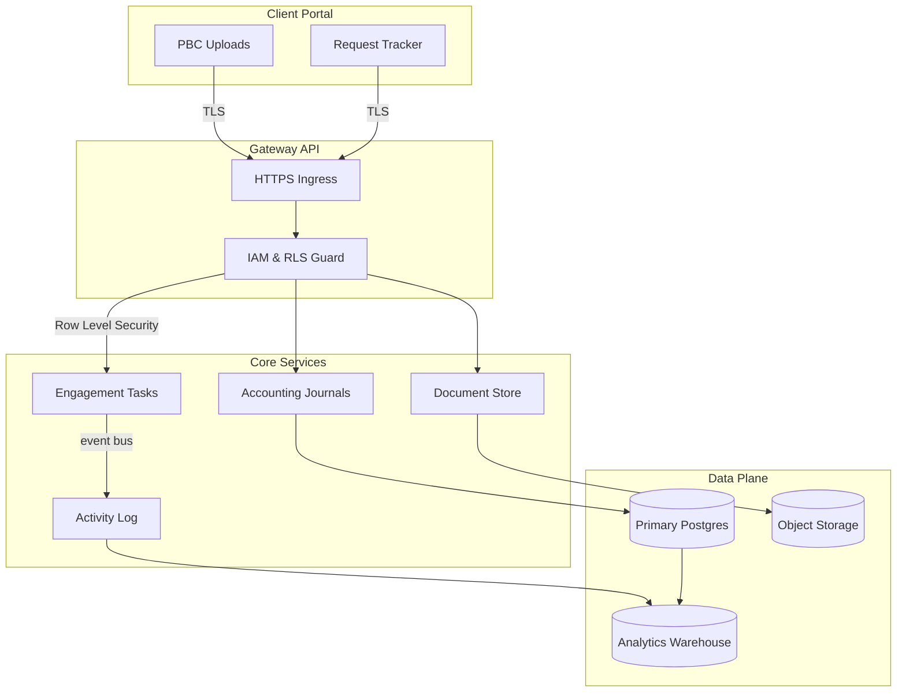
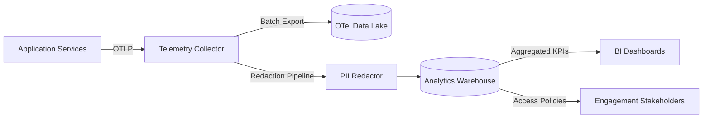

# Data Flow Diagrams & Retention Controls

This document captures the end-to-end movement of identifiable data across Prisma Glow services and the automated controls that enforce our retention and anonymisation policies.

## Customer Workspace Lifecycle

## Operational Telemetry Flow

## Retention Windows & Anonymisation Schedule

The following table is generated from `POLICY/data-retention-policy.json`. Update that file and re-run the maintenance scripts whenever new datasets or requirements are introduced.

<!-- retention-policy-table:start -->

| Dataset | Retention Window | Storage Systems | Anonymisation Job | Schedule |
| --- | --- | --- | --- | --- |
| Activity Log Events | 365 days (roll-off after archival) | Primary Postgres, Analytics Warehouse | activity-log-anonymizer | 0 2 * * * |
| Document Attachments | 730 days (soft delete after 180 days) | Object Storage | document-attachment-rotator | 0 3 * * 0 |
| Engagement Journals | 2555 days (7 years) | Primary Postgres | journal-ledger-sanitizer | 30 1 * * 0 |
| Support Transcripts | 180 days | Analytics Warehouse | support-transcript-purger | 0 */6 * * * |

<!-- retention-policy-table:end -->

### Control Owners

- **Data Platform**: Owns Terraform automation, Kubernetes CronJobs, and monitoring dashboards that back the schedules above.
- **Security & Compliance**: Reviews policy alignment quarterly and signs off on anonymisation scripts.
- **SRE**: Provides observability hooks and alerting for overdue jobs or retention drift.

### Evidence Collection

- Terraform plan outputs for the `data_retention` module.
- Maintenance run logs generated by `scripts/maintenance/run_data_retention.mjs`.
- CI artefacts from the `policy:verify` job ensuring documentation stays in sync.
