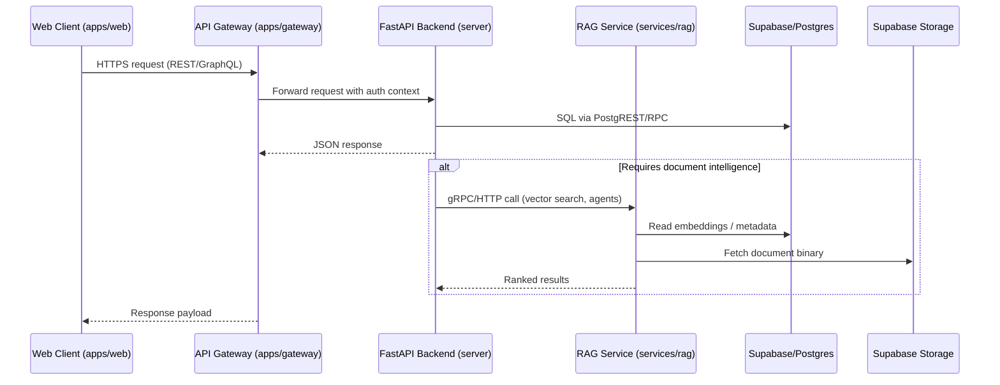
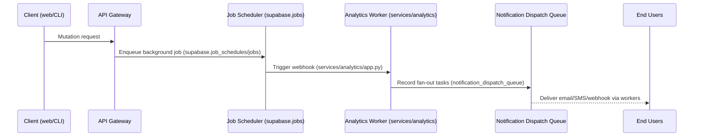

# Client → API → Data Plane Flows

## Interactive request flow

```mermaid
sequenceDiagram
    participant Web as Web Client (apps/web)
    participant Gateway as API Gateway (apps/gateway)
    participant FastAPI as FastAPI Backend (server)
    participant RAG as RAG Service (services/rag)
    participant DB as Supabase/Postgres
    participant Storage as Supabase Storage

    Web->>Gateway: HTTPS request (REST/GraphQL)
    Gateway->>FastAPI: Forward request with auth context
    FastAPI->>DB: SQL via PostgREST/RPC
    FastAPI-->>Gateway: JSON response
    alt Requires document intelligence
        FastAPI->>RAG: gRPC/HTTP call (vector search, agents)
        RAG->>DB: Read embeddings / metadata
        RAG->>Storage: Fetch document binary
        RAG-->>FastAPI: Ranked results
    end
    Gateway-->>Web: Response payload
```

## Event fan-out flow

```mermaid
sequenceDiagram
    participant Client as Client (web/CLI)
    participant Gateway as API Gateway
    participant Jobs as Job Scheduler (supabase.jobs)
    participant AnalyticsSvc as Analytics Worker (services/analytics)
    participant Queue as Notification Dispatch Queue
    participant Users as End Users

    Client->>Gateway: Mutation request
    Gateway->>Jobs: Enqueue background job (supabase.job_schedules/jobs)
    Jobs->>AnalyticsSvc: Trigger webhook (services/analytics/app.py)
    AnalyticsSvc->>Queue: Record fan-out tasks (notification_dispatch_queue)
    Queue-->>Users: Deliver email/SMS/webhook via workers
```
