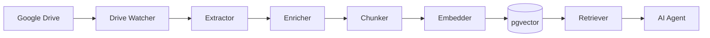
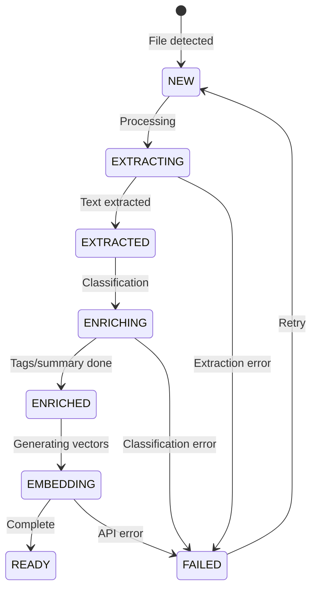

# Knowledge Factory Architecture

> Production-grade Knowledge Base for Accounting & Tax AI Agents

## Overview

The Knowledge Factory ingests documents from Google Drive, processes them through an enrichment pipeline, and stores vector embeddings for RAG-powered retrieval with full audit trail and governance controls.



---

## Components

### 1. Drive Watcher (`services/rag/knowledge/drive.ts`)
- Monitors Google Drive folders for new/updated files
- Uses `changes.list` API with page tokens
- Stores sync state in `gdrive_connectors`

### 2. Extractor (`services/rag/knowledge/extractor.ts`)
- PDF: pypdf / pdf-parse with page mapping
- DOCX: mammoth with heading preservation
- HTML/TXT/MD: native parsing
- OCR fallback via Google Document AI

### 3. Enricher (`services/rag/knowledge/enricher.ts`)
- Gemini-based classification
- Outputs:
  - `standard`: IFRS | ISA | GAAP | TAX | AUDIT_METHODOLOGY | OTHER
  - `jurisdiction`: Rwanda | Malta | EU | US | Unknown
  - `doc_type`: LAW | REGULATION | STANDARD | GUIDANCE | TEMPLATE | CASE | BOOK
  - `confidentiality`: PUBLIC | INTERNAL | RESTRICTED
- Generates short/long summaries, key points
- Extracts topics and entities

### 4. Chunker (`services/rag/knowledge/chunker.ts`)
- 800-1200 tokens per chunk, 100-200 overlap
- Respects heading/section boundaries
- Preserves page_start/page_end
- Stores heading_path (e.g., "IFRS 15 > Step 3 > Allocation")

### 5. Embedder (`server/rag.py`)
- OpenAI `text-embedding-3-small` (configurable)
- Stores in pgvector (`kb_embeddings` table)
- Idempotent via content_hash

### 6. Retriever (`services/rag/knowledge/retriever.ts`)
- Tenant-isolated vector search
- Confidentiality access enforcement
- Filters: standard, jurisdiction, effective_date, doc_type
- Returns citations with page references

---

## Data Model

```mermaid
erDiagram
    kb_sources ||--o{ kb_documents : contains
    kb_documents ||--|| kb_document_text : has
    kb_documents ||--o| kb_summaries : has
    kb_documents ||--o| kb_tags : has
    kb_documents ||--o{ kb_chunks : split_into
    kb_chunks ||--|| kb_embeddings : has
    kb_runs ||--o{ kb_documents : processes
    kb_audit_trail }o--|| kb_chunks : references

    kb_sources {
        uuid id PK
        uuid tenant_id FK
        string name
        string drive_folder_id
        boolean include_subfolders
        boolean active
    }

    kb_documents {
        uuid id PK
        uuid tenant_id FK
        uuid source_id FK
        string drive_file_id
        string name
        string mime_type
        string sha256
        enum standard
        string jurisdiction
        date effective_date
        enum doc_type
        enum confidentiality
        enum status
    }

    kb_chunks {
        uuid id PK
        uuid document_id FK
        int chunk_index
        string heading_path
        int page_start
        int page_end
        text content
        int token_count
        string content_hash UK
    }

    kb_embeddings {
        uuid chunk_id FK PK
        vector embedding
        string embedding_model
        int dims
    }

    kb_audit_trail {
        uuid id PK
        uuid tenant_id FK
        uuid user_id
        text query
        jsonb retrieved_chunk_ids
        uuid response_id
    }
```

---

## Security Model

### Tenant Isolation
- All tables include `tenant_id` column
- RLS policies enforce `is_member_of(tenant_id)`
- Queries MUST include tenant context

### Confidentiality Levels

| Level | Description | Access Rule |
|-------|-------------|-------------|
| PUBLIC | Publicly available standards | All authenticated users |
| INTERNAL | Internal firm materials | EMPLOYEE role or above |
| RESTRICTED | Client-confidential, copyrighted | MANAGER role + explicit grant |

### RBAC Integration
- Uses existing `has_min_role()` function
- Retrieval filters by user's role
- Audit trail logs all access

---

## Pipeline States



---

## Implementation Phases

| Phase | Description | Status |
|-------|-------------|--------|
| 1 | Discovery + Architecture docs | ✅ Complete |
| 2 | Database schema (kb_* tables) | Pending |
| 3 | Drive connector enhancement | Pending |
| 4 | Extraction layer | Pending |
| 5 | Enrichment (Gemini) | Pending |
| 6 | Chunking + Embedding | Pending |
| 7 | Retrieval with filters | Pending |
| 8 | Agent integration | Pending |
| 9 | CLI orchestration | Pending |
| 10 | Eval harness | Pending |

---

## Environment Variables

```bash
# Required
GDRIVE_SERVICE_ACCOUNT_EMAIL=
GDRIVE_SERVICE_ACCOUNT_KEY=
GDRIVE_FOLDER_ID=
GEMINI_API_KEY=
OPENAI_API_KEY=
SUPABASE_URL=
SUPABASE_SERVICE_ROLE_KEY=

# Optional
KB_OCR_PROVIDER=none|google
KB_EMBEDDING_MODEL=text-embedding-3-small
KB_CHUNK_SIZE=1000
KB_CHUNK_OVERLAP=150
```

---

## API Endpoints

| Method | Path | Description |
|--------|------|-------------|
| POST | `/api/kb/sync` | Trigger Drive sync |
| POST | `/api/kb/backfill` | Full reprocess |
| POST | `/api/kb/reindex` | Rebuild embeddings |
| GET | `/api/kb/search` | Vector search |
| GET | `/api/kb/documents` | List documents |
| GET | `/api/kb/runs` | List pipeline runs |

---

## CLI Commands

```bash
# Sync latest changes from Drive
pnpm kb:sync --org-id=<uuid>

# Full backfill
pnpm kb:backfill --org-id=<uuid> --dry-run

# Rebuild embeddings for a document
pnpm kb:reindex --document-id=<uuid>

# Verify access controls
pnpm kb:verify --org-id=<uuid> --user-role=EMPLOYEE
```

---

## Observability

- **Logs**: Structured JSON with run_id, document_id, stage
- **Metrics**: processed_count, failed_count, embedding_latency
- **Traces**: Sentry integration (20% sampling)
- **Alerts**: Failed documents > 10% threshold
