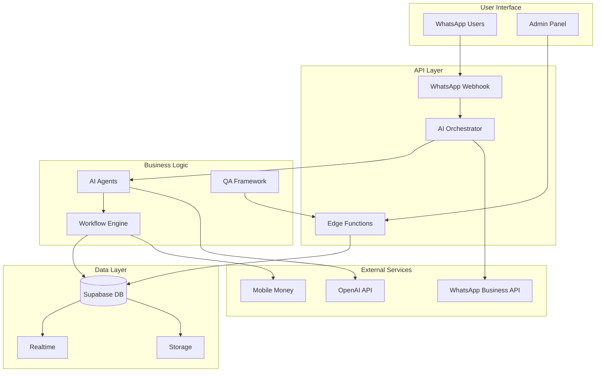
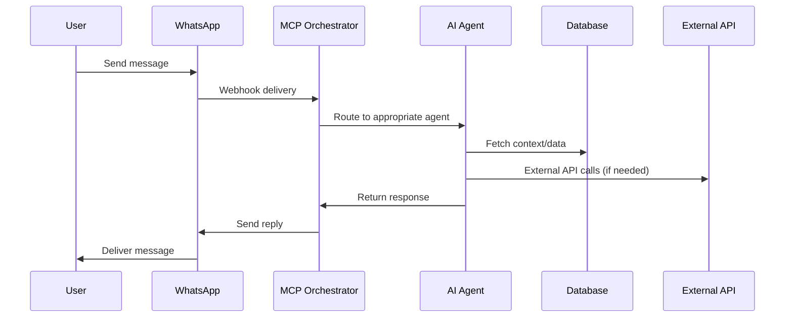
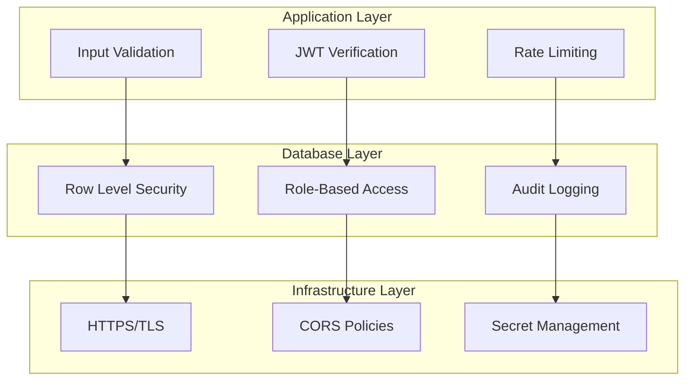
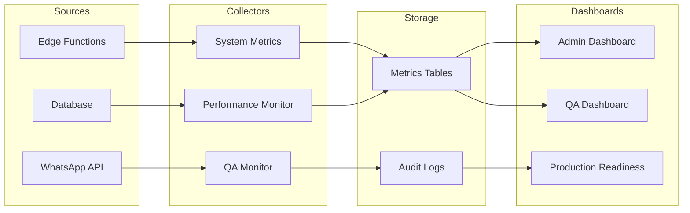
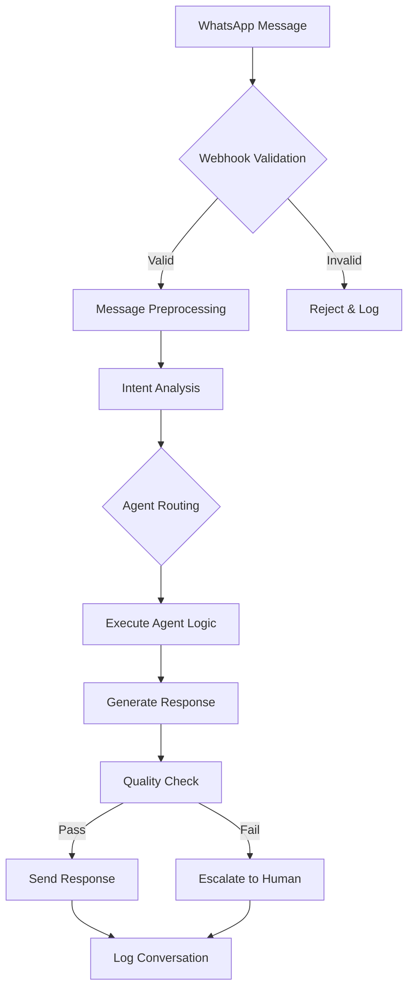
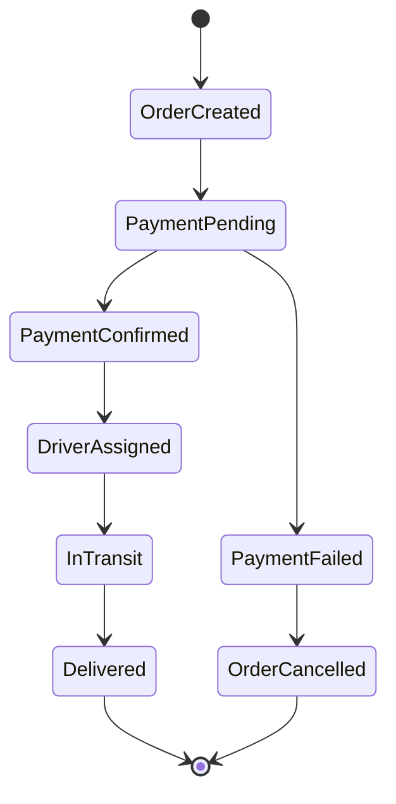
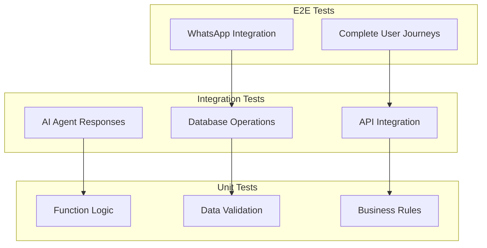
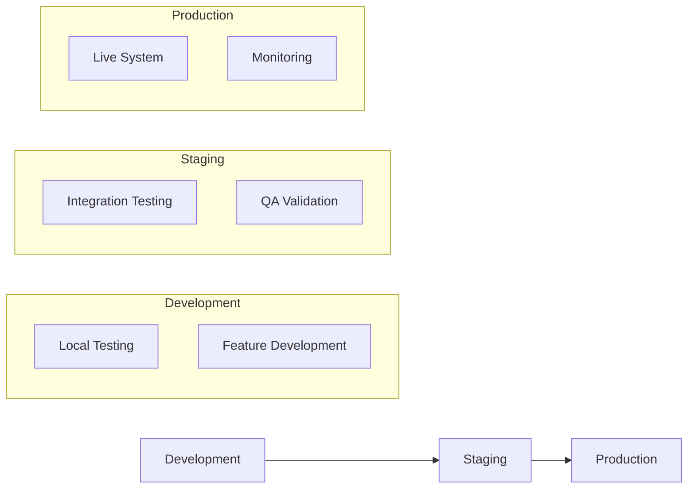

# easyMO System Architecture Documentation

## 🏗️ High-Level Architecture



## 🧠 AI Agent Architecture

### Agent Hierarchy
```
MCP Orchestrator
├── OnboardingAgent (User registration)
├── PaymentAgent (Mobile money)
├── MarketplaceAgent (Product discovery)
├── LogisticsAgent (Driver matching)
├── BusinessAgent (Bar/Pharmacy/Hardware)
├── EventsAgent (Event booking)
├── MarketingAgent (Campaigns)
└── SupportAgent (Customer service)
```

### Agent Communication Flow


## 🗄️ Database Schema Overview

### Core Tables
- **users**: User profiles and authentication
- **conversations**: Message history and context
- **agents**: AI agent configurations
- **businesses**: Business registrations
- **products**: Inventory across verticals
- **orders**: Purchase transactions
- **deliveries**: Logistics tracking

### Security Tables
- **user_roles**: Role-based access control
- **security_audit_log**: Security event tracking
- **performance_metrics**: System monitoring

### QA Tables
- **qa_test_suites**: Test suite definitions
- **qa_test_cases**: Individual test cases
- **qa_test_runs**: Test execution results

## 🚀 Edge Functions Architecture

### Function Categories

#### 1. Core System Functions
- `whatsapp-webhook`: Main WhatsApp message processor
- `whatsapp-unified-handler`: Unified message routing
- `mcp-orchestrator`: AI agent coordination
- `response-sender`: Message delivery

#### 2. AI & Processing Functions
- `ai-processor`: Core AI message processing
- `yaml-agent-processor`: YAML-based agent execution
- `unified-message-handler`: Message preprocessing
- `quality-evaluator`: Response quality assessment

#### 3. Business Logic Functions
- `assign-driver`: Driver-passenger matching
- `generate-payment`: Payment processing
- `create-pharmacy-order`: Medicine ordering
- `fare-estimator`: Price calculations

#### 4. Administration Functions
- `security-audit-engine`: Security monitoring
- `qa-execution-engine`: Test automation
- `production-optimizer`: Performance tuning
- `system-health-monitor`: Health checks

#### 5. Marketing & Automation
- `marketing-automation`: Campaign management
- `cron-scheduler`: Background job execution
- `drip-scheduler`: Automated messaging
- `push-marketing`: Targeted campaigns

## 🔐 Security Architecture

### Multi-Layer Security


### RLS Policy Examples
```sql
-- Users can only access their own data
CREATE POLICY "Users own data" ON conversations
  FOR ALL USING (user_id = auth.uid());

-- Admins can access everything
CREATE POLICY "Admin access" ON conversations
  FOR ALL USING (is_admin());

-- Business owners can access their business data
CREATE POLICY "Business owner access" ON products
  FOR ALL USING (business_id IN (
    SELECT id FROM businesses WHERE owner_user_id = auth.uid()
  ));
```

## 📊 Monitoring & Observability

### Metrics Collection


### Key Performance Indicators
- **Response Time**: AI agent response latency
- **Success Rate**: Message processing success rate
- **Error Rate**: System error frequency
- **Uptime**: System availability percentage

## 🔄 Data Flow Patterns

### User Message Processing


### Order Processing Flow


## 🧪 Testing Architecture

### Test Pyramid


### QA Automation
- **Continuous Testing**: Automated test execution on deployment
- **Performance Benchmarking**: Response time monitoring
- **Load Testing**: Concurrent user simulation
- **Security Scanning**: Automated vulnerability assessment

## 🚀 Deployment Architecture

### Environment Stages


### CI/CD Pipeline
1. **Code Push**: Git repository update
2. **Build**: TypeScript compilation and optimization
3. **Test**: Automated test suite execution
4. **Deploy**: Edge function deployment
5. **Monitor**: Health check verification

## 📈 Scaling Considerations

### Horizontal Scaling
- **Edge Functions**: Auto-scaling based on demand
- **Database**: Connection pooling and read replicas
- **Storage**: CDN integration for static assets

### Performance Optimization
- **Caching**: Response caching for frequent queries
- **Indexing**: Optimized database indexes
- **Compression**: Message and asset compression

---

This architecture supports the easyMO WhatsApp super-app's requirements for scalability, reliability, and maintainability while ensuring security and performance standards.